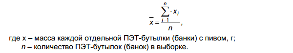

Государственный стандарт Республики Беларусь СТБ 395-2017

# Пиво. Общие технические условия

Издание официальное

УДК 663.41 (083.74)(476)
МКС 67.160.10
КП 03

Ключевые слова: пиво, пшеничное пиво, специальное пиво, ячмень, продукция пищевая, показатели физико-химические и органолептические, правила приемки, методы контроля, упаковка, маркировка, транспортирование, хранение

ОКП РБ 11.05.10

## Предисловие

Цели, основные принципы, положения по государственному регулированию и управлению в области технического нормирования и стандартизации установлены Законом Республики Беларусь «О техническом нормировании и стандартизации».

1. РАЗРАБОТАН республиканским унитарным предприятием «Научно-практический центр Национальной академии наук Беларуси по продовольствию» ВНЕСЕН Национальным техническим комитетом по стандартизации «Продовольственное сырье и продукты его переработки»
2. УТВЕРЖДЕН И ВВЕДЕН В ДЕЙСТВИЕ постановлением Госстандарта Республики Беларусь от 29 июня 2017 г. № 52
3. ВЗАМЕН СТБ 395-2005

Дата введения 2019-01-01 (Измененная редакция, ИУ ТНПА № 7-2017)

## 1. Область применения

Настоящий стандарт распространяется на пиво, получаемое путем сбраживания охмеленного сусла пивными дрожжами.

## 2. Нормативные ссылки

В настоящем стандарте использованы ссылки на следующие технические нормативные правовые акты в области технического нормирования и стандартизации (далее - ТИПА):

ТР ТС 005/2011 О безопасности упаковки 
ТР ТС 015/2011 О безопасности зерна 
ТР ТС 021/2011 О безопасности пищевой продукции 
ТР ТС 022/2011 Пищевая продукция в части ее маркировки 
ТР ТС 023/2011 Технический регламент на соковую продукцию из фруктов и овощей 
ТР ТС 029/2012 Требования безопасности пищевых добавок, ароматизаторов и технологических вспомогательных средств 
СТБ 539-2006 Напитки безалкогольные. Общие технические условия 
СТБ 1036-97 Продукты пищевые и продовольственное сырье. Методы отбора проб для определения показателей безопасности 
СТБ 1053-2015 Радиационный контроль. Отбор проб пищевой продукции. Общие требования 
СТБ 1100-2016 Пищевая продукция. Информация для потребителя. Общие требования 
СТБ 1188-99 Вода питьевая. Общие требования к организации и методам контроля качества 
СТБ 1334-2003 Спирт этиловый ректификованный из пищевого сырья. Технические условия 
СТБ 1823-2008 Консервы. Соки фруктовые прямого отжима. Общие технические условия 
СТБ 1824-2008 Консервы. Соки фруктовые восстановленные. Общие технические условия 
СТБ 1825-2008 Соки фруктовые концентрированные. Технические условия 
СТБ 2193-2011 Концентраты квасного сусла и квасов. Общие технические условия 
СТБ 2351-2014 Технологическая документация. Технологическая инструкция на пищевую продукцию. Общие требования к разработке 
СТБ 8019-2002 Система обеспечения единства измерений Республики Беларусь. Товары фасованные. Общие требования к количеству товара 
СТБ ГОСТ Р 52022-2003 Тара стеклянная для пищевой и парфюмерно-косметической продукции. Марки стекла 
ГОСТ 490-2006 Добавки пищевые. Кислота молочная Е270. Технические условия 
ГОСТ 1770-74 (ИСО 1042-83, ИСО 4788-80) Посуда мерная лабораторная стеклянная. Цилиндры, мензурки, колбы, пробирки. Общие технические условия 
ГОСТ 3560-73 Лента стальная упаковочная. Технические условия 
ГОСТ 5060-86 Ячмень пивоваренный. Технические условия ГОСТ 5194-91 Патока крахмальная. Технические условия 
ГОСТ 6002-69 Крупа кукурузная. Технические условия 
ГОСТ 6292-93 Крупа рисовая. Технические условия 
ГОСТ 6672-75 Стекла покровные для микропрепаратов. Технические условия 
ГОСТ 7376-89 Картон гофрированный. Общие технические условия 
ГОСТ 7699-78 Крахмал картофельный. Технические условия 
ГОСТ 7933-89 Картон для потребительской тары. Общие технические условия 
ГОСТ 8050-85 Двуокись углерода газообразная и жидкая. Технические условия 
ГОСТ 9218-2015 Автомобильные транспортные средства для перевозки пищевых жидкостей. Технические требования и методы испытаний 
ГОСТ 9353-2016 Пшеница. Технические условия 
ГОСТ 10117.1-2001 Бутылки стеклянные для пищевых жидкостей. Общие технические условия 
ГОСТ 10117.2-2001 Бутылки стеклянные для пищевых жидкостей. Типы, параметры и основные размеры 
ГОСТ 10354-82 Пленка полиэтиленовая. Технические условия 
ГОСТ 10444.12-2013 Микробиология пищевых продуктов и кормов для животных. Методы выявления и подсчета количества дрожжей и плесневых грибов 
ГОСТ 10444.15-94 Продукты пищевые. Методы определения количества мезофильных аэробных и факультативно-анаэробных микроорганизмов 
ГОСТ 12786-80 Пиво. Правила приемки и методы отбора проб 
ГОСТ 12787-81 Пиво. Методы определения спирта, действительного экстракта и расчет сухих веществ в начальном сусле 
ГОСТ 12788-87 Пиво. Методы определения кислотности 
ГОСТ 12789-87 Пиво. Методы определения цвета 
ГОСТ 13516-86 Ящики из гофрированного картона для консервов, пресервов и пищевых жидкостей. Технические условия 
ГОСТ 14192-96 Маркировка грузов 
ГОСТ 16990-88 Рожь. Требования при заготовках и поставках 
ГОСТ 18251-87 Лента клеевая на бумажной основе. Технические условия 
ГОСТ 19792-2001 Мед натуральный. Технические условия 
ГОСТ 20477-86 Лента полиэтиленовая с липким слоем. Технические условия 
ГОСТ 21946-76 Хмель-сырец. Технические условия 
ГОСТ 21947-76 Хмель прессованный. Технические условия 
ГОСТ 22983-88 Просо. Требования при заготовках и поставках 
ГОСТ 23285-78 Пакеты транспортные для пищевых продуктов и стеклянной тары. Технические условия 
ГОСТ 24104-2001 Весы лабораторные. Общие технические требования 
ГОСТ 24597-81 Пакеты тарно-штучных грузов. Основные параметры и размеры 
ГОСТ 25336-82 Посуда и оборудование лабораторные стеклянные. Типы, основные параметры и размеры 
ГОСТ 25776-83 Продукция штучная в потребительской таре. Упаковка групповая в термоусадочную пленку 
ГОСТ 25951-83 Пленка полиэтиленовая термоусадочная. Технические условия 
ГОСТ 26381-84 Поддоны плоские одноразового использования. Общие технические условия 
ГОСТ 26663-85 Пакеты транспортные. Формирование с применением средств пакетирования. Общие технические требования 
ГОСТ 26669-85 Продукты пищевые и вкусовые. Подготовка проб для микробиологических анализов 
ГОСТ 26670-91 Продукты пищевые. Методы культивирования микроорганизмов 
ГОСТ 26927-86 Сырье и продукты пищевые. Методы определения ртути 
ГОСТ 26929-94 Сырье и продукты пищевые. Подготовка проб. Минерализация для определения содержания токсичных элементов 
ГОСТ 26930-86 Сырье и продукты пищевые. Метод определения мышьяка 
ГОСТ 26932-86 Сырье и продукты пищевые. Методы определения свинца 
ГОСТ 26933-86 Сырье и продукты пищевые. Методы определения кадмия 
ГОСТ 28673-90 Овес. Требования при заготовках и поставках 
ГОСТ 29018-91 Пивоваренная промышленность. Термины и определения 
ГОСТ 29227-91 (ИСО 835-1-81) Посуда лабораторная стеклянная. Пипетки градуированные. Часть 1. Общие требования 
ГОСТ 29272-92 Солод ржаной сухой. Технические условия 
ГОСТ 29294-2014 Солод пивоваренный. Технические условия 
ГОСТ 30060-93 Пиво. Методы определения органолептических показателей и объема продукции 
ГОСТ 30178-96 Сырье и продукты пищевые. Атомно-абсорбционный метод определения токсичных элементов 
ГОСТ 30538-97 Продукты пищевые. Методика определения токсичных элементов атомно-эмиссионным методом 
ГОСТ 30712-2001 Продукты безалкогольной промышленности. Методы микробиологического анализа 
ГОСТ 31659-2012 (ISO 6579:2002) Продукты пищевые. Метод выявления бактерий рода Salmonella 
ГОСТ 31747-2012 (ISO 4831:2006, ISO 4832:2006) Продукты пищевые. Методы выявления и определения количества бактерий группы кишечных палочек (колиформных бактерий) 
ГОСТ 31764-2012 Пиво. Метод определения pH 
ГОСТ 31904-2012 Продукты пищевые. Методы отбора проб для микробиологических испытаний 
ГОСТ 32038-2012 Пиво. Методы определения двуокиси углерода 
ГОСТ 32159-2013 Крахмал кукурузный. Общие технические условия 
ГОСТ 32912-2014 Хмелепродукты. Общие технические условия 
ГОСТ 33222-2015 Сахар белый. Технические условия 
ГОСТ 33757-2016 Поддоны плоские деревянные. Технические условия

Примечание — При пользовании настоящим стандартом целесообразно проверить действие ТНПА по каталогу, составленному по состоянию на 1 января текущего года, и по соответствующим информационным указателям, опубликованным в текущем году.
Если ссылочные ТНПА заменены (изменены), то при пользовании настоящим стандартом следует руководствоваться заменяющими (измененными) ТНПА. Если ссылочные ТНПА отменены без замены, то положение. в котором дана ссылка на них, применяется в части, не затрагивающей эту ссылку.

## 3. Термины и определения

В настоящем стандарте применяют термины, установленные в СТБ 1100, ГОСТ 29018, ТР ТС 021, а также следующие термины с соответствующими определениями:

3.1 **пиво**: Пенистый напиток, полученный из пивоваренного солода, хмеля и (или) хмелепродуктов и воды с использованием пивных дрожжей, с применением или без применения зерна, зернопродуктов, сахаросодержащих продуктов и другого пивоваренного сырья, содержащий спирт, образовавшийся исключительно в процессе брожения сусла.

3.2 **пшеничное пиво**: Пиво с содержанием пшеничного солода не менее 50 % от общего количества применяемого сырья, с применением или без применения пшеницы.

3.3 **специальное пиво**: Пиво, изготовленное с применением плодового и (или) растительного сырья и (или) продуктов их переработки, сахаросодержащих продуктов, натуральных ароматизаторов, пищевых добавок, с содержанием пива в готовом напитке не менее 80 % и содержащее спирт, образовавшийся исключительно в процессе брожения сусла.

3.4 **специальное пшеничное пиво**: Пшеничное пиво, изготовленное с применением плодового и (или) растительного сырья и (или) продуктов их переработки, сахаросодержащих продуктов, натуральных ароматизаторов, пищевых добавок, с содержанием пива в готовом напитке не менее 80 % и содержащее спирт, образовавшийся исключительно в процессе брожения сусла.

3.5 **безалкогольное пиво**: Пиво с объемной долей спирта не более 0,5 %.

3.6 **светлое пиво** Пиво с показателем «цвет» от 0,2 до 2,5 ц. ед. включительно или от 3,4 до 31 ед. ЕВС включительно.

3.7 **темное пиво**: Пиво с показателем «цвет» свыше 2.5 ц. ед. или свыше 31 ед. ЕВС.

3.8 **одна кислотная единица (к. ед.)**: Единица кислотности пива, эквивалентная кубическому сантиметру раствора гидроокиси натрия концентрацией 1 моль/дм3 на 100 см3 пива.

3.9 **одна цветовая единица (ц. ед.)**: Единица цвета пива, соответствующая цвету раствора из 100 см3 воды и 1 см3 раствора йода концентрацией 0,1 моль/дм3.

3.10 **единица цвета ЕВС (ед. ЕВС)**: Условная единица цвета пива, принятая Европейской пивоваренной конвенцией и рассчитываемая на основе измерения оптической плотности пива.

Примечание - ЕВС - European Brewery Convention (Европейская пивоваренная конвенция).

3.11 **осветленное пиво**: Пиво, от которого естественным или искусственным путем отделены взвешенные частицы и дрожжи.

3.12 **нефильтрованное пиво**: Пиво, изготовленное без искусственного удаления дрожжевых клеток, взвешенных и коллоидных частиц.

3.13 **неосветленное нефильтрованное пиво**: Пиво с содержанием дрожжевых клеток не более 10,0 млн в 1 см3.

3.14 **осветленное нефильтрованное пиво**: Пиво с содержанием дрожжевых клеток не более 2,0 млн в 1 см3.

3.15 **фильтрованное пиво**: Пиво, из которого путем фильтрации через фильтрующие перегородки, с применением или без применения вспомогательных фильтрующих средств, удалены дрожжевые клетки, взвешенные и коллоидные частицы.

3.16 **пастеризованное пиво**: Пиво с повышенной биологической стойкостью, получаемой путем тепловой обработки.

3.17 **пивоваренное сырье**: Пищевое сырье, используемое для приготовления пива, в том числе пивоваренный солод, специальный пивоваренный солод, концентрат пивного сусла, солодовый экстракт, зерно, зернопродукты. хмель, хмелепродукты, сахаросодержащие продукты.

3.18 **пивоваренный солод**: Солод, изготовленный из пивоваренного ячменя или пшеницы.

3.19 **специальный пивоваренный солод**: Солод, изготовленный из пивоваренного ячменя или других видов зерна с использованием технологических приемов обработки зерна, в том числе солодоращения, обеспечивающих придание готовому специальному пивоваренному солоду и изготовленному на его основе пиву специфических свойств и характеристик.

3.20 **сахаросодержащие продукты**: Пищевое сырье, включающее в себя натуральный мед, сахар белый, сахарный, фруктозный, глюкозный, декстрозный, глюкозо-фруктозный, мальтозный и мальтозо- глюкозный сиропы, патоку крахмальную, карамелизованный сахар.

3.21 **обеспложивание; холодная стерилизация пива, холодно-стерильный розлив пива**. Дополнительное стерилизующее фильтрование пива через обеспложивающий картон, мембранные или модульные фильтры после основного фильтрования с целью получения пива с высокой биологической стойкостью.

## 4. Классификация

Классификацию пива осуществляют по двум признакам: цвет и способы обработки.

4.1 В зависимости от цвета пиво подразделяют на два типа: светлое и темное.

4.2 В зависимости от способов обработки пиво подразделяют на:

 * непастеризованное;
 * пастеризованное;
 * нефильтрованное;
 * фильтрованное (с применением или без применения стабилизирующих средств);
 * неосветленное;
 * осветленное;
 * обеспложенное.

Примечания

1. При изготовлении пива допускается использовать один или несколько из вышеуказанных способов обработки.
2. Допускается при вынесении информации о способе обработки пива вместо «обеспложенного» указывать «пиво холодной стерилизации» или «пиво, разлитое холодно-стерильным способом».
3. При маркировке фильтрованного пива допускается не указывать информацию о применении стабилизирующих средств.

## 5. Общие технические требования

5.1 Пиво должно соответствовать требованиям настоящего стандарта и изготавливаться по технологической инструкции на конкретное наименование, согласованной и утвержденной в установленном порядке, с соблюдением требований ТР ТС 021, санитарных норм и правил, гигиенических нормативов для производства пищевой продукции, в том числе [[1](#f1)].

5.2 Построение, изложение и оформление технологической инструкции на пиво должно осуществляться в соответствии с СТБ 2351.

5.3 Характеристики

5.3.1 По органолептическим показателям пиво должно соответствовать требованиям, указанным в [таблице 1](#t1).

5.3.2 По физико-химическим показателям светлое пиво должно соответствовать требованиям, указанным в [таблице 2](#t2).

5.3.3 По физико-химическим показателям темное пиво должно соответствовать требованиям, указанным в [таблице 3](#t3).

5.3.4 По физико-химическим показателям пшеничное светлое и темное пиво должно соответствовать требованиям, указанным в [таблице 4](#t4).

5.3.5 По физико-химическим показателям безалкогольное светлое и темное пиво должно соответствовать требованиям, указанным в [таблице 5](#t5).

5.3.6 Конкретные характеристики и значения органолептических, физико-химических показателей, пищевую ценность устанавливает изготовитель в технологической инструкции на пиво конкретного наименования, согласованной и утвержденной в установленном порядке.

5.3.7 Информационные показатели пищевой ценности пива приведены в приложении А.

5.3.8 Концентрация дрожжевых клеток в нефильтрованном пиве, млн/см3, не более:

 * неосветленном - 10,0;
 * осветленном - 2,0.

5.3.9 По содержанию токсичных элементов. N-нитрозаминов пиво должно соответствовать требованиям, установленным в ТР ТС 021, [[2](#f2)], [[3](#f3)].

5.3.10 По микробиологическим показателям пиво должно соответствовать требованиям, установленным в ТР ТС 021, [[2](#f2)], [[3](#f3)], [таблице 6](#t6).

5.3.11 По содержанию радионуклидов пиво должно соответствовать требованиям, установленным в [[4](#f4)].

5.3.12 Пищевые добавки, ароматизаторы, технологические вспомогательные средства вносят в пиво в количествах, позволяющих гарантировать выполнение требований, установленных в ТР ТС 029, [[5](#f5)], [[6](#f6)].

5.4 Требования к сырью, пищевым добавкам, ароматизаторам и технологическим вспомогательным средствам

5.4.1 Для изготовления пива применяют основное сырье, пищевые добавки и технологические вспомогательные средства:

 * солод пивоваренный по ГОСТ 29294;
 * солод ржаной сухой по ГОСТ 29272;
 * ячмень пивоваренный по ГОСТ 5060;
 * пшеницу по ГОСТ 9353;
 * рожь по ГОСТ 16990;
 * овес по ГОСТ 28673;
 * просо по ГОСТ 22983;
 * крупу кукурузную по ГОСТ 6002;
 * крупу рисовую по ГОСТ 6292;
 * крахмал кукурузный по ГОСТ 32159;
 * крахмал картофельный по ГОСТ 7699;
 * воду питьевую по СТБ 1188, [[7](#f7)];
 * хмель гранулированный, хмелепродукты по ГОСТ 32912;
 * хмель-сырец по ГОСТ 21946;
 * хмель прессованный по ГОСТ 21947;
 * концентрат квасного сусла, концентраты и экстракты квасов по СТБ 2193;
 * сахар белый по ГОСТ 33222;
 * мед натуральный по ГОСТ 19792;
 * патоку крахмальную по ГОСТ 5194;
 * кислоту молочную пищевую по ГОСТ 490;
 * двуокись углерода по ГОСТ 8050.

5.4.2 Для изготовления пива применяют дополнительное сырье, пищевые добавки и технологические вспомогательные средства:

 * солод пивоваренный пшеничный карамельный;
 * сахарный сироп;
 * карамелизованный сахарный сироп;
 * пивные дрожжи;
 * колер сахарный;
 * кислоту аскорбиновую;
 * сахаросодержащие продукты;
 * натуральную текстурированную ячменную или пшеничную муку;
 * солод пивоваренный специальный (тритикалевый солод, карамельный солод, жженый солод, кислый солод, томленый солод, меланоидиновый солод и др.);
 * солодовый и ржаной экстракты;
 * солодовую муку;
 * жженый ячмень;
 * красящее пиво;
 * хлорид (сульфат) кальция;
 * хлорид (сульфат) цинка;
 * ферментные препараты;
 * антиокислители;
 * регуляторы кислотности;
 * стабилизирующие средства (силикагели, поливинилполипирролидон и др.);
 * осветлители;
 * дрожжевые подкормки.

5.4.3 Для изготовления пива специального, пива специального пшеничного применяют сырье, пищевые добавки и технологические вспомогательные средства по 5.4.1, 5.4.2, а также:

 * соки фруктовые концентрированные по СТБ 1825;
 * соки фруктовые восстановленные по СТБ 1824;
 * соки фруктовые прямого отжима по СТБ 1823;
 * экстракты пищевые из растительного сырья;
 * плодово-ягодное сырье:
 * пряно-ароматическое растительное сырье и продукты их переработки;
 * натуральные ароматизаторы.

5.4.4 Допускается применение других наименований зерна и продуктов его переработки (муки, крупы и др.) по другим ТНПА и разрешенных для применения в пищевой промышленности.

Допускается применение указанного сырья, пищевых добавок, ароматизаторов и технологических вспомогательных средств по другим ТНПА по показателям качества не ниже требований, установленных в вышеперечисленных ТНПА.

Примечание - Рекомендуемые требования к качеству солода пивоваренного ячменного устанавливают в договоре (контракте) между поставщиком и изготовителем пива, но не ниже требований, установленных в ГОСТ 29294.

5.4.5 Наименование сырья, пищевых добавок, ароматизаторов и их расход на 1000 дал готового пива указывают для пива конкретного наименования в технологической инструкции по его изготовлению, согласованной и утвержденной в установленном порядке.

5.4.6 По показателям безопасности и безвредности для человека применяемое сырье должно соответствовать требованиям, установленным в ТР ТС 015, ТР ТС 021, ТР ТС 023, [[2](#f2)], [[3](#f3)].

5.4.7 Содержание радионуклидов в сырье не должно превышать республиканские допустимые уровни, установленные в [[4](#f4)], ТР ТС 021.

5.4.8 Пищевые добавки, ароматизаторы, технологические вспомогательные средства и их применение - в соответствии с требованиями, установленными в ТР ТС 029, [[5](#f5)], [[6](#f6)].

5.5 Упаковка

5.5.1 Упаковка и укупорочные средства должны обеспечивать качество, безопасность и сохранность пива в течение срока годности при соблюдении условий транспортирования, хранения и реализации и соответствовать требованиям, установленным в ТР ТС 005, [[8](#f8)], [[9](#f9)]. 

5.5.2 Пиво разливают в потребительскую упаковку:

 * бутылки стеклянные по ГОСТ 10117.1 и ГОСТ 10117.2, типа Ха и типа Хб, или по ТНПА, изготовленные из стекла марок и химического состава по СТБ ГОСТ Р 52022;
 * бутылки одноразового использования из полимерных материалов (далее - ПЭТ-бутылки) по ТНПА;
 * металлические банки (далее - банки) по ТНПА.

Пиво разливают непосредственно в транспортную упаковку:

 * кеги - многоразового использования из нержавеющей стали или одноразового использования из полимерных материалов емкости по ТНПА;
 * цистерны различной вместимости по ГОСТ 9218.

Допускается применять другие типы потребительской и транспортной упаковки по ТНПА.

Допускается розлив пива в бутылки стеклянные многооборотные и многооборотные кеги.

Бутылки стеклянные многооборотные и многооборотные кеги перед повторным использованием должны подвергаться обязательной мойке в соответствии с технологической инструкцией по их обработке, разработанной и утвержденной в установленном порядке.

5.5.3 Требования к партии упакованного пива, количеству пива, содержащегося в упаковочной единице, - по СТБ 8019.

5.5.4 Предел допускаемых отрицательных отклонений содержимого упаковочной единицы от номинального количества - в соответствии с требованиями СТБ 8019.

5.5.5 Положительные отклонения содержимого упаковочной единицы от номинального количества не ограничиваются.

5.5.6 Потребительская упаковка с пивом должна быть герметично укупорена укупорочными средствами, отвечающими требованиям, установленным в ТР ТС 005, [[8](#f8)], [[9](#f9)].

5.5.7 Кеги с пивом должны быть оснащены специальным клапаном, обеспечивающим их герметичность при транспортировании и хранении. Кеги с пивом герметично укупориваются укупорочными средствами, отвечающими требованиям, установленным в ТР ТС 005, [[8](#f8)], [[9](#f9)].

5.5.8 Степень заполнения цистерн должна составлять не менее 95 % от их полной вместимости.

5.5.9 Цистерны после заполнения должны быть герметично закрыты и опломбированы.

5.5.10 Стеклянные бутылки с пивом помещают в транспортную упаковку: ящики из картона гофрированного по ГОСТ 13516 или ТИПА, в проволочные, металлические, пластмассовые ящики и металлические складные ящичные поддоны по ТНПА.

Соединение стыка клапана крышки и дна ящика из гофрированного картона осуществляют лентой клеевой на бумажной основе по ГОСТ 18251, или лентой полиэтиленовой с липким слоем по ГОСТ 20477, или горячеплавким клеем по ТНПА или сшивают металлическими скобами по ТНПА.

5.5.11 Стеклянные бутылки, ПЭТ-бутылки, банки допускается упаковывать в художественно оформленные сувенирные коробки по ТНПА, в групповую упаковку, сформированную из пленки полиэтиленовой термоусадочной по ГОСТ 25951, без прокладочных средств, на лотки или прокладки из картона гофрированного по ГОСТ 7376 или картона по ГОСТ 7933. Упаковку осуществляют в соответствии с требованиями ГОСТ 25776.

Допускается изготовление лотков или прокладок из других материалов по ТНПА по показателям прочности не хуже указанных в ГОСТ 7933.

5.5.12 При необходимости пиво в групповой упаковке и кегах формируют в пакеты транспортные на плоских поддонах по ГОСТ 33757 или ГОСТ 26381.

5.5.13 Пакетирование на поддонах производят в соответствии с ГОСТ 23285, ГОСТ 24597 и ГОСТ 26663.

Для скрепления транспортных пакетов применяют пленку полиэтиленовую по ГОСТ 10354, пленку полиэтиленовую термоусадочную по ГОСТ 25951, ленту стальную по ГОСТ 3560, полипропиленовую ленту или растягивающуюся пленку по ТНПА.

При формировании транспортных пакетов с помощью термоусадочной пленки не допускается сварка ее с пленкой упаковки.

5.6 Маркировка

5.6.1 Маркировка пива должна осуществляться в соответствии с требованиями настоящего стандарта, ТР ТС 022, СТБ 1100, СТБ 8019.

5.6.2 Маркировка пива наносится на каждую единицу потребительской упаковки в удобном для прочтения месте.

5.6.3 Маркировка потребительской упаковки должна содержать следующую информацию:

 * наименование, включающее придуманное название пива;
 * тип пива;
 * способы обработки (допускается не указывать «фильтрованное», «осветленное»);
 * наименование и местонахождение изготовителя;
 * товарный знак изготовителя (при наличии);
 * массовую долю сухих веществ в начальном сусле (экстрактивность начального сусла), % (кроме безалкогольного пива);
 * объемную долю спирта, % («алк. % об.» или «спирт % об.»), для безалкогольного пива - «алк. не более ... %» или «спирт не более ... %»;
 * состав пива;
 * дату розлива и срок годности;
 * условия хранения;
 * объем, л, сл или мл;
 * пищевую ценность 100 мл пива;
 * обозначение настоящего стандарта;
 * штриховой идентификационный код;
 * надпись «Безалкогольное» (для безалкогольного пива);
 * рекомендуемые условия хранения после вскрытия потребительской упаковки;
 * предупредительную надпись, указывающую возрастные и иные ограничения употребления пива в соответствии с законодательством Республики Беларусь;
 * предупредительную надпись о вреде чрезмерного употребления алкоголя в соответствии с требованиями законодательства Республики Беларусь;
 * информацию о наличии компонентов, полученных с применением генно-модифицированных организмов (далее - ГМО) (в случае, если при изготовлении пива было использовано сырье, пищевые добавки, ароматизаторы, полученные с применением ГМО);
 * единый знак обращения продукции на рынке Евразийского экономического союза.

5.6.4 На каждый кег с пивом должна быть наклеена этикетка либо размещен ярлык с указанием информации согласно 5.6.3, при этом штриховой идентификационный код указывается в случае необходимости.

5.6.5 Каждая цистерна с пивом должна сопровождаться следующей информацией:

 * наименование, включающее придуманное название пива;
 * тип пива;
 * способы обработки (допускается не указывать «фильтрованное», «осветленное»);
 * наименование и местонахождения изготовителя;
 * массовая доля сухих веществ в начальном сусле (экстрактивность начального сусла), % (кроме безалкогольного пива);
 * объемная доля спирта, % («алк. % об.» или «спирт % об.»), для безалкогольного пива - «алк. не более ... %» или «спирт не более ... %»;
 * дата розлива и срок годности;
 * условия хранения;
 * объем, л;
 * номер партии;
 * обозначение настоящего стандарта;
 * единый знак обращения продукции на рынке Евразийского экономического союза.

5.6.6 Дату розлива и срок годности наносят четко различаемым шрифтом, выделяющимся на любом фоне.

5.6.7 Маркировка транспортной упаковки, в которую помещено пиво в потребительской упаковке, -  по ТР ТС022, ГОСТ 14192, с нанесением манипуляционных знаков «Хрупкое. Осторожно», «Верх» (для пива, упакованного в стеклянные бутылки или банки) и с указанием следующей информации:

 * наименование, включающее придуманное название пива;
 * тип пива;
 * способы обработки (допускается не указывать «фильтрованное», «осветленное»);
 * наименование и местонахождение изготовителя;
 * дата розлива и срок годности;
 * условия хранения;
 * объем единицы потребительской упаковки, л, сл или мл;
 * количество единиц потребительских упаковок в единице транспортной упаковки;
 * сведения, позволяющие идентифицировать партию пива (например, номер партии). 

5.6.8 В случае если маркировка, нанесенная на потребительскую упаковку с пивом, помещенную в транспортную упаковку, может быть доведена до сведения потребителей без нарушения целостности транспортной упаковки, то маркировку, предусмотренную 5.6.7, допускается не наносить на транспортную упаковку, за исключением сведений, позволяющих идентифицировать партию пива.

5.6.9 В маркировке пива могут быть указаны дополнительные сведения, не противоречащие требованиям настоящего стандарта, ТР ТС 022, СТБ 1100.

## 6. Правила приемки

6.1 Правила приемки - по ГОСТ 12786, с уточнением: для пива, разлитого в банки, соблюдаются требования к объему и правила отбора выборки, применяемые к пиву, разлитому в бутылки; для пива. разлитого в кеги, - к пиву, разлитому в бочки.

6.2 Пиво принимается партиями. Партией считается определенное количество (объем) пива одного наименования, одинаково упакованного, одного типа и способа обработки, произведенного одним изготовителем по настоящему стандарту, одной даты розлива, сопровождаемое товаросопроводительной документацией, обеспечивающей прослеживаемость пива, с указанием следующей информации:

 * номера и даты выдачи документа;
 * наименования и местонахождения изготовителя;
 * наименования, включающего придуманное название пива;
 * типа пива;
 * способов обработки (допускается не указывать «фильтрованное», «осветленное»);
 * объема пива в партии, л;
 * даты розлива и срока годности;
 * условий хранения;
 * результатов испытаний по органолептическим и физико-химическим показателям;
 * типа упаковки;
 * обозначения настоящего стандарта;
 * количества потребительских упаковок в единице транспортной упаковки.

Товаросопроводительная документация должна быть заверена подписями ответственных лиц и печатью (штампом).

6.3 При транспортировании пива в цистернах каждую цистерну принимают за партию.

6.4 Контроль пива на соответствие требованиям настоящего стандарта осуществляет отдел технохимического контроля (лаборатория изготовителя и (или) сторонняя аккредитованная лаборатория) в соответствии со схемой технохимического контроля.

6.5 Для контроля упакованного пива по показателям «содержимое упаковочной единицы (объем упакованного пива)», «предел допускаемых отрицательных отклонений содержимого упаковочной единицы от номинального количества» и «среднее содержимое партии упакованного пива» от партии пива, разлитого в бутылки или банки, методом наибольшей объективности отбирают выборку объемом 10 бутылок (банок). Партия упакованного пива по данным показателям принимается при одновременном выполнении следующих условий:

а) среднее содержимое партии должно быть больше или равно значению номинального объема;

б) количество бракованных упаковочных единиц, у которых отрицательное отклонение содержимого упаковочной единицы превышает предел допускаемых отрицательных отклонений по СТБ 8019, должно быть меньше или равно приемочному числу плана контроля по ГОСТ 12786;

в) не допускается наличие упаковочных единиц, у которых отрицательное отклонение содержимого упаковочной единицы превышает удвоенное значение предела допускаемых отрицательных отклонений по СТБ 8019.

6.6 Контроль органолептических и физико-химических показателей, концентрации дрожжевых клеток в нефильтрованном пиве, содержимого упаковочной единицы (объема упакованного пива), объема пива в кегах, предела допускаемых отрицательных отклонений содержимого упаковочной единицы от номинального количества, соблюдения требований к партии упакованного пива, состояния упаковки, качества маркировки и герметичности укупорки осуществляют в каждой партии в соответствии с порядком, установленным изготовителем и гарантирующим качество и безопасность пива.

6.7 Контроль содержания токсичных элементов, микробиологических показателей, N-нитрозаминов осуществляют в соответствии с порядком, установленным изготовителем продукции в программе производственного контроля и гарантирующим качество и безопасность пива, но не реже одного раза в год.

6.8 Контроль количества вносимых пищевых добавок и ароматизаторов, количества используемых технологических вспомогательных средств осуществляют в соответствии с порядком, установленным изготовителем продукции в программе производственного контроля и гарантирующим качество и безопасность пива.

6.9 Контроль содержания радионуклидов осуществляют в соответствии со схемой радиационного контроля, утвержденной в установленном порядке.

6.10 При получении неудовлетворительных результатов анализа пива со сроком годности более 30 сут хотя бы по одному из показателей содержания потенциально опасных химических веществ (токсичных элементов, N-нитрозаминов) или из микробиологических показателей проводят повторные испытания по этому показателю на удвоенной выборке образцов из той же партии. Результаты повторных испытаний являются окончательными и распространяются на всю партию. При повторном получении неудовлетворительных результатов партию пива бракуют.

## 7. Методы контроля

7.1 Отбор проб - по ГОСТ 12786, отбор и подготовка проб для определения показателей безопасности и радиационного контроля - по ГОСТ 26929, СТБ 1036, СТБ 1053, отбор, подготовка проб и культивирование микроорганизмов для определения микробиологических показателей - по ГОСТ 31904, ГОСТ 26669, ГОСТ 26670.

7.2 Объемную долю спирта Vсп, %, рассчитывают по формуле

7.3 Определение массовой доли сухих веществ в начальном сусле (экстрактивности начального сусла) - по ГОСТ 12787.

7.4 Определение кислотности - по ГОСТ 12788.

7.5 Определение pH - по ГОСТ 31764.

7.6 Определение цвета - по ГОСТ 12789, для пересчета цветовых единиц в единицы цвета ЕВС используют приложение Б.

7.7 Определение массовой доли двуокиси углерода - по ГОСТ 32038.

7.8 Определение органолептических показателей - по ГОСТ 30060.

7.9 Определение содержания токсичных элементов - по ГОСТ 26927. ГОСТ 26930, ГОСТ 26932. ГОСТ 26933, ГОСТ 30178, ГОСТ 30538.

7.10 Определение N-нитрозаминов - по [[10](#f10)].

7.11 Определение микробиологических показателей - по ГОСТ 10444.12. ГОСТ 10444.15. ГОСТ 30712, ГОСТ 31659, ГОСТ 31747.

7.12 Определение содержания радионуклидов осуществляют по методикам, включенным в [[11](#f11)].

7.13 Состояние транспортной и потребительской упаковки, качество маркировки и герметичность укупорки определяют визуально и по ГОСТ 30060, путем осмотра каждой отобранной единицы упаковки по ГОСТ 12786.

7.14 Определение концентрации дрожжевых клеток в нефильтрованном пиве

7.14.1 Сущность метода

Сущность метода заключается в определении концентрации дрожжевых клеток в нефильтрованном пиве под микроскопом в счетной камере Горяева.

7.14.2 Аппаратура, материалы, реактивы

Микроскоп биологический МБИ, МБР. Допускается применение иных микроскопов с метрологическими характеристиками не ниже приведенных выше.

Осветитель к микроскопу ОИ-19.

Стекла покровные для микропрепаратов по ГОСТ 6672.

Камера для счета форменных элементов крови и клеточных элементов спинномозговой жидкости (камера Горяева) или другая по ТИПА.

Колба П-1-250-29/32 ТС или других размеров по ГОСТ 25336.

Колба П-2-250-34 ТХС или других размеров по ГОСТ 25336.

Пробирка П1-16-150 ХС или других размеров по ГОСТ 25336. Пробирка П2-10-90 ХС или других размеров по ГОСТ 25336. Пипетки градуированные по ГОСТ 29227.

Спирт этиловый ректификованный из пищевого сырья по СТБ 1334. Вода питьевая по СТБ 1188, [[7](#f7)].

7.14.3 Подготовка к испытанию

Перед проведением подсчета клеток счетную камеру Горяева и покровное стекло моют и обезжиривают. Для обезжиривания стекло обрабатывают хромовой смесью, а затем ополаскивают водой. Чистые покровные стекла хранят в банке со спиртом.

С помощью микроскопа ориентировочно определяют количество дрожжевых клеток в анализируемой пробе нефильтрованного пива. Если в большом квадрате сетки камеры Горяева количество дрожжевых клеток превышает 20, то пробу разводят в соответствии с ГОСТ 26669 питьевой водой при температуре 20 °С.

7.14.4 Проведение испытания

Отобранную пробу перед микроскопированием встряхивают. Подсчет дрожжевых клеток проводят под микроскопом в камере Горяева.

Каплю нефильтрованного пива наносят на поверхность счетной камеры и покрывают шлифованным покровным стеклом. Подсчет клеток начинают через 3-5 мин после заполнения камеры, для того чтобы клетки осели и были видны под микроскопом в одной плоскости. Подсчитывают клетки в 10 больших квадратах сетки камеры, перемещая их по диагонали сетки. Учитывают все клетки, лежащие в квадрате сетки, а также пересекающие верхнюю и правую стороны квадрата.

7.14.5 Обработка результатов

Концентрацию дрожжевых клеток в нефильтрованном пиве М, млн/см3, 

вычисляют по формуле где а - среднее количество (число) дрожжевых клеток в одном квадрате;

Вычисление проводят до второго десятичного знака. За результат испытаний принимают среднее арифметическое результатов двух параллельных измерений и выражают целым числом с двумя десятичными знаками с последующим округлением до одного десятичного знака. Расхождение между результатами двух измерений, выполненных в разных лабораториях для одной и той же партии, не должно превышать 7 %. Результат выражают в миллионах клеток в сантиметре кубическом.

7.15 Допускается определение концентрации дрожжевых клеток в нефильтрованном пиве при помощи счетчика дрожжевых клеток по другим методикам, утвержденным в установленном порядке.

7.16 Определение объема упакованного пива

Измерения объема упакованного пива, разлитого в бутылки или банки, должны выполняться с погрешностью, не превышающей 1 / 5 предела допускаемых отрицательных отклонений содержимого упаковочной единицы от номинального количества согласно 5.5.4.

7.16.1.1 Определение объема упакованного пива, разлитого в бутылки и банки, проводят при помощи прямых измерений по ГОСТ 30060, с уточнением: для проведения испытаний используют цилиндры мерные лабораторные стеклянные по ГОСТ 1770 вместимостью 25, 100, 250, 500, 1000, 2000 см3.

7.16.2 Определение объема упакованного пива, разлитого в ПЭТ-бутылки или банки, при помощи косвенных измерений

Сущность метода заключается в определении объема пива, разлитого в ПЭТ-бутылки или банки, без открывания ПЭТ-бутылок или банок.

7.16.2.1 Аппаратура, материалы, реактивы

Весы лабораторные общего назначения по ГОСТ 24104, с пределами взвешивания, соответствующими определяемой массе, с допускаемой погрешностью взвешивания ±375 мг. 

Допускается использование других средств измерения, имеющих метрологические характеристики не ниже указанных.

7.16.2.2 Проведение испытания

Отбирают пустые ПЭТ-бутылки или банки вместе с укупорочными средствами в количестве 10 шт. и взвешивают на лабораторных весах с точностью до 1,0 г.

Помечают каждую взвешенную ПЭТ-бутылку или банку.

Помеченные ПЭТ-бутылки или банки заполняют пивом на линии розлива.

Помеченные укупоренные ПЭТ-бутылки или банки, заполненные пивом, взвешивают на лабораторных весах с точностью до 1,0 г.

7.16.2.3 Обработка результатов

Среднюю массу пустой ПЭТ-бутылки или банки вместе с укупорочным средством у вычисляют по формуле

Среднюю массу укупоренной ПЭТ-бутылки или банки

7.17 Определение среднего содержимого партии упакованного пива

Среднее содержимое упаковочной единицы (среднее содержимое партии упакованного пива) V, мл, рассчитывают по формуле

Полученные значения V сравнивают с номинальным объемом, указанным в маркировке, и проверяют соблюдение критерия приемки партии по 6.5 (перечисление а)).

Контроль среднего содержимого партии на этапе изготовления допускается осуществлять в соответствии с методикой, установленной изготовителем. Результаты контроля документируют и хранят в соответствии с принятыми на предприятии правилами.

7.18 Определение соблюдения предела допускаемых отрицательных отклонений содержимого упаковочной единицы от номинального объема - по СТБ 539 (пункт 7.6.4). При этом проверяют соблюдение критериев приемки партии по 6.5 (перечисления б) и в)).

7.19 Определение объема пива, разлитого в кеги, осуществляют при помощи косвенных измерений по СТБ 539 (пункт 7.6.3), с уточнением: относительную плотность пива при 20 °С с/^° определяют по ГОСТ 12787.

7.20 Количество вносимых в пиво пищевых добавок, ароматизаторов, используемых технологических вспомогательных средств контролируют с применением аналитических методов исследований или по закладке весовым методом на весах лабораторных по ГОСТ 24104:

 * высокого класса точности, с ценой деления 0,01 г, с наибольшим пределом взвешивания 0,2 кг;
 * среднего класса точности, с ценой деления 1,0 г, с наибольшим пределом взвешивания 10,0 кг.

Допускается применение других средств измерения, внесенных в Государственный реестр средств измерений Республики Беларусь, с метрологическими характеристиками не ниже указанных.

7.21 Допускается проведение испытаний по другим утвержденным в установленном порядке ТИПА на методы контроля, а также по методикам выполнения измерений, аттестованным в соответствии с законодательством Республики Беларусь, которые обеспечивают сопоставимость результатов испытаний при их использовании.

При проведении испытаний допускается применение других средств измерения, внесенных в Государственный реестр средств измерений Республики Беларусь, с метрологическими характеристиками не ниже, указанных в настоящем стандарте.

7.22 Для осуществления оценки (подтверждения) соответствия пива требованиям ТР ТС021, ТР ТС 029 отбор проб и испытания по показателям безопасности проводят по документам, включенным в [[12](#f12)], [[13](#f13)].

## 8. Транспортирование и хранение

8.1 Пиво транспортируют всеми видами транспорта в соответствии с Правилами перевозок грузов, действующими на соответствующем виде транспорта, и требованиями ТР ТС 021, [[1](#f1)].

Пакетирование грузовых мест проводят по ГОСТ 23285.

8.2 Транспортирование пива в торговые точки, оборудованные изотермическими резервуарами, или на базы розлива производят в цистернах, обеспечивающих качество и безопасность пива.

8.3 Срок годности и условия хранения пива устанавливает изготовитель в технологической инструкции на пиво конкретного наименования, согласованной и утвержденной в установленном порядке.

8.4 Срок годности пива исчисляют с даты розлива.

8.5 Рекомендуемые сроки годности и условия хранения пива приведены в приложении В.

8.6 Срок годности пива может быть увеличен изготовителем в зависимости от особенностей технологического процесса, применяемого сырья, упаковки и укупорочных средств, условий хранения в соответствии с порядком, установленным [[14](#f14)].

## 9. Гарантии изготовителя

Изготовитель гарантирует соответствие пива требованиям настоящего стандарта при соблюдении установленных условий транспортирования и хранения.

## Таблицы

### Таблица 1

<table>
<thead>
<tr>
<th rowspan="3">Наименование показателя</th>
<th colspan="4">Характеристика пива</th>
</tr>
<tr>
<th colspan="2">фильтрованного или фильтрованного обеспложенного</th>
<th colspan="2">нефильтрованного (осветленного или неосветленного)</th>
</tr>
<tr>
<th>светлого</th>
<th>темного</th>
<th>светлого</th>
<th>темного</th>
</tr>
</thead>
<tbody>
<tr>
<td>Внешний вид</td>
<td colspan="2">Прозрачная пенящаяся жидкость без осадка и посторонних включений, не свойственных пиву. В процессе хранения допускается появление частиц белково-дубильных соединений. Для пшеничного пива допускается наличие опалесценции</td>
<td colspan="2">Непрозрачная или прозрачная с опалесценцией пенящаяся жидкость без посторонних включений, не свойственных пиву. Допускается наличие дрожжевого осадка и частиц белково-дубильных соединений</td>
</tr>
<tr>
<td rowspan="2">Аромат</td>
<td colspan="2">Чистый, сброженный, солодовый, хмелевой, без посторонних запахов</td>
<td colspan="2">Сброженный, солодовый, хмелевой, без посторонних запахов. Допускается наличие дрожжевого тона</td>
</tr>
<tr>
<td colspan="4">Для пшеничного пива характерно наличие пряного (фенольного) аромата</td>
</tr>
<tr>
<td rowspan="3">Вкус</td>
<td>Чистый, сброженный, солодовый, с характерной хмелевой горечью, без посторонних привкусов</td>
<td>Полный, солодовый, с выраженным привкусом карамельного или жженого солода, без посторонних привкусов</td>
<td>Сброженный, солодовый, с характерной хмелевой горечью, без посторонних привкусов. Допускается слабый дрожжевой привкус</td>
<td>Солодовый, с выраженным привкусом карамельного или жженого солода, без посторонних привкусов. Допускается слабый дрожжевой привкус</td>
</tr>
<tr>
<td colspan="4">Для пшеничного пива характерно наличие пряного привкуса</td>
</tr>
<tr>
<td colspan="4">Для пива с массовой долей сухих веществ в начальном сусле (экстрактивностью начального сусла) 15 % и более характерно наличие винного привкуса</td>
</tr>
<tr>
<td colspan="5">Примечание - Для пива специального органолептические показатели - в соответствии с технологической инструкцией на пиво специальное конкретного наименования.</td>
</tr>
</tbody>
</table>

### Таблица 2

<table>
<thead>
<tr>
<th rowspan="2">Наименование показателя для светлого пива</th>
<th colspan="17">Массовая доля сухих веществ в начальном сусле (экстрактивность начального сусла), %</th>
</tr>
<tr>
<th>от 6,0 до 6,9</th>
<th>от 7,0 до 7,9</th>
<th>от 8,0 до 8,9</th>
<th>от 9,0 до 9,9</th>
<th>от 10,0 до 10,9</th>
<th>от 11,0 до 11,9</th>
<th>от 12,0 до 12,9</th>
<th>от 13,0 до 13,9</th>
<th>от 14,0 до 14,9</th>
<th>от 15,0 до 15,9</th>
<th>от 16,0 до 16,9</th>
<th>от 17,0 до 17,9</th>
<th>от 18,0 до 18,9</th>
<th>от 19,0 до 19,9</th>
<th>от 20,0 до 20,9</th>
<th>от 21,0 до 21,9</th>
<th>от 22,0 до 23,0</th>
</tr>
</thead>
<tbody>
<tr>
<td>Объемная доля спирта, %, не менее *</td>
<td>1,8</td>
<td>2,1</td>
<td>2,8</td>
<td>3,2</td>
<td>3,6</td>
<td>4,0</td>
<td>4,5</td>
<td>4,7</td>
<td>4,8</td>
<td>5,4</td>
<td>5,8</td>
<td>6,2</td>
<td>6,6</td>
<td>7,1</td>
<td>7,9</td>
<td>8,2</td>
<td>8,6</td>
</tr>
<tr>
<td>Кислотность, к. ед.</td>
<td colspan="4" style="text-align: center;">0,6-2,5</td>
<td colspan="2" style="text-align: center;">1,0-2,8</td>
<td colspan="2" style="text-align: center;">1,0-3,3</td>
<td colspan="2" style="text-align: center;">1,5-3,8</td>
<td colspan="2" style="text-align: center;">2,0-4,5</td>
<td colspan="5" style="text-align: center;">2,5-5,0</td>
</tr>
<tr>
<td>pH</td>
<td colspan="17" style="text-align: center;">от 3,8 до 4,8</td>
</tr>
<tr>
<td>Цвет, ц. ед.</td>
<td colspan="17" style="text-align: center;">от 0,2 до 2,5 включ.</td>
</tr>
<tr>
<td>Цвет, ед. ЕВС</td>
<td colspan="17" style="text-align: center;">от 3,4 до 31 включ.</td>
</tr>
<tr>
<td>Массовая доля двуокиси угле­рода, %,не менее</td>
<td colspan="17" style="text-align: center;">0,30</td>
</tr>
<tr>
<td>Пенообразование: - высота пены, мм, не менее - пеностойкость, мин, не менее</td>
<td colspan="17" style="text-align: center;">30 3</td>
</tr>
<tr>
<td colspan="18">* В технологической инструкции на пиво конкретного наименования устанавливается конкретное (целевое) значение объемной доли спирта. При этом допускаемое отклонение от объемной доли спирта, установленной в технологической инструкции на пиво конкретного наименования, составляет ±0,5 %.</td>
</tr>
<tr>
<td colspan="18">Примечания 
1 Массовую долю двуокиси углерода определяют в пиве, разлитом в бутылки и металлические банки. 
2 Допускаемое отклонение массовой доли сухих веществ в начальном сусле (экстрактивности начального сусла) - ±0,3 %. 
3 Допускается определять один из показателей - «кислотность» или «pH». 
4 Допускается выражать показатель «цвет» в одной из указанных единиц.</td>
</tr>
</tbody>
</table>

### Таблица 3

<table>
<thead>
<tr>
<th rowspan="2">Наименование показателя для темного пива</th>
<th colspan="17">Массовая доля сухих веществ в начальном сусле (экстрактивность начального сусла), %</th>
</tr>
<tr>
<th>от 6,0 до 6,9</th>
<th>от 7,0 до 7,9</th>
<th>от 8,0 до 8,9</th>
<th>от 9,0 до 9,9</th>
<th>от 10,0 до 10,9</th>
<th>от 11,0 до 11,9</th>
<th>от 12,0 до 12,9</th>
<th>от 13,0 до 13,9</th>
<th>от 14,0 до 14,9</th>
<th>от 15,0 до 15,9</th>
<th>от 16,0 до 16,9</th>
<th>от 17,0 до 17,9</th>
<th>от 18,0 до 18,9</th>
<th>от 19,0 до 19,9</th>
<th>от 20,0 до 20,9</th>
<th>от 21,0 до 21,9</th>
<th>от 22,0 до 23,0</th>
</tr>
</thead>
<tbody>
<tr>
<td>Объемная доля спирта, %, не менее *</td>
<td>1,6</td>
<td>1,8</td>
<td>2,4</td>
<td>3,0</td>
<td>3,4</td>
<td>3,7</td>
<td>4,1</td>
<td>4,2</td>
<td>4,7</td>
<td>4,9</td>
<td>5,2</td>
<td>5,7</td>
<td>5,9</td>
<td>6,0</td>
<td>6,2</td>
<td>7,4</td>
<td>8,0</td>
</tr>
<tr>
<td>Кислотность, к. ед.</td>
<td colspan="4" style="text-align: center;">0,8-2,2</td>
<td colspan="2" style="text-align: center;">1,4-2,8</td>
<td colspan="2" style="text-align: center;">1,6-3,5</td>
<td colspan="2" style="text-align: center;">2,2-3,7</td>
<td colspan="2" style="text-align: center;">2,5-4,5</td>
<td colspan="5" style="text-align: center;">3,5-5,5</td>
</tr>
<tr>
<td>pH</td>
<td colspan="17" style="text-align: center;">От 3,8 до 4,8</td>
</tr>
<tr>
<td>Цвет, ц. ед.</td>
<td colspan="17" style="text-align: center;">Св. 2,5</td>
</tr>
<tr>
<td>Цвет, ед. ЕВС</td>
<td colspan="17" style="text-align: center;">Св. 31</td>
</tr>
<tr>
<td>Массовая доля двуокиси угле­рода, %,не менее</td>
<td colspan="17" style="text-align: center;">0,30</td>
</tr>
<tr>
<td>Пенообразование: - высота пены, мм, не менее - пеностойкость, мин, не менее</td>
<td colspan="17" style="text-align: center;">30 3</td></tr>
<tr>
<td colspan="18">* В технологической инструкции на пиво конкретного наименования устанавливается конкретное (целевое) значение объемной доли спирта. При этом допускаемое отклонение от объемной доли спирта, установленной в технологической инструкции на пиво конкретного наименования, составляет ±0,5 %.</td>
</tr>
<tr>
<td colspan="18">Примечания 
1 Массовую долю двуокиси углерода определяют в пиве, разлитом в бутылки и металлические банки. 
2 Допускаемое отклонение массовой доли сухих веществ в начальном сусле (экстрактивности начального сусла) - ±0,3 %. 
3 Допускается определять один из показателей - «кислотность» или «pH». 
4 Допускается выражать показатель «цвет» в одной из указанных единиц.</td>
</tr>
</tbody>
</table>

### Таблица 4

<table>
<thead>
<tr>
<th rowspan="2">Наименование показателя</th>
<th colspan="5">Массовая доля сухих веществ в начальном сусле (экстрактивность начального сусла). %</th>
</tr>
<tr>
<th>от 11,0 до 11,9</th>
<th>от 12,0 до 12,9</th>
<th>от 13,0 до 13,9</th>
<th>от 14,0 до 14.9</th>
<th>от 15.0 до 15.9</th>
</tr>
</thead>
<tbody>
<tr>
<td>Объемная доля спирта, %, не менее *</td>
<td>2,5</td>
<td>3,5</td>
<td>4,5</td>
<td>4,5</td>
<td>5,0</td>
</tr>
<tr>
<td>Кислотность, к. ед., не более</td>
<td colspan="5">3,2</td>
</tr>
<tr>
<td>pH</td>
<td colspan="5">От 3,6 до 4,8</td>
</tr>
<tr>
<td>Цвет, ц. ед.: - для светлого пива - для темного пива</td>
<td colspan="5">От 0,2 до 2,5 включ. Св. 2,5</td>
</tr>
<tr>
<td>Цвет, ед. ЕВС: - для светлого пива - для темного пива</td>
<td colspan="5">От 3,4 до 31 включ. Св. 31</td>
</tr>
<tr>
<td>Массовая доля двуокиси углерода. %, не менее</td>
<td colspan="5">0,30</td>
</tr>
<tr>
<td>Пенообразование: - высота пены, мм, не менее - пеностойкость, мин, не менее</td>
<td colspan="5">30 3</td>
</tr>
<tr>
<td colspan="6">* В технологической инструкции на пиво конкретного наименования устанавливается конкретное (целевое) значение объемной доли спирта. При этом допускаемое отклонение от объемной доли спирта, установленной в технологической инструкции на пиво конкретного наименования, составляет ±0,5 %.</td>
</tr>
<tr>
<td colspan="6">Примечания 
1 Массовую долю двуокиси углерода определяют в пиве, разлитом в бутылки и металлические банки. 
2 Допускаемое отклонение массовой доли сухих веществ в начальном сусле (экстрактивности начального сусла) - ±0.3 %. 
3 Допускается определять один из показателей - «кислотность» или «pH». 
4 Допускается выражать показатель «цвет» в одной из указанных единиц.</td>
</tr>
</tbody>
</table>

### Таблица 5

<table>
<thead>
<tr>
<th>Наименование показателя</th>
<th>Значение</th>
</tr>
</thead>
<tbody>
<tr>
<td>Объемная доля спирта, %, не более</td>
<td>0,5</td>
</tr>
<tr>
<td>Кислотность, к. ед., не более</td>
<td>3,0</td>
</tr>
<tr>
<td>pH</td>
<td>От 3,8 до 4,8</td>
</tr>
<tr>
<td>Цвет, ц. ед.: - для светлого пива</td>
<td>От 0,2 до 2,5 включ.</td>
</tr>
<tr>
<td>- для темного пива</td>
<td>Св. 2,5</td>
</tr>
<tr>
<td>Цвет. ед. ЕВС: - для светлого пива</td>
<td>От 3,4 до 31 включ.</td>
</tr>
<tr>
<td>- для темного пива</td>
<td>Св. 31</td>
</tr>
<tr>
<td>Массовая доля двуокиси углерода. %, не менее</td>
<td>0,30</td>
</tr>
<tr>
<td>Пенообразование: - высота пены, мм, не менее</td>
<td>20</td>
</tr>
<tr>
<td>- пеностойкость, мин, не менее</td>
<td>2</td>
</tr>
<tr>
<td colspan="2">Примечания 
1 Массовую долю сухих веществ в начальном сусле (экстрактивность начального сусла) в безалкогольном пиве не определяют. 
2 Массовую долю двуокиси углерода определяют в безалкогольном пиве, разлитом в бутылки и металличе­ские банки. 
3 Допускается определять один из показателей - «кислотность» или «pH». 
4 Допускается выражать показатель «цвет» в одной из указанных единиц.</td>
</tr>
</tbody>
</table>

### Таблица 6

<table>
<thead>
<tr>
<th>Наименование пива</th>
<th>Наименование показателя</th>
<th>Значение</th>
</tr>
</thead>
<tbody>
<tr>
<td>Пиво непастеризованное:</td>
<td>&nbsp;</td>
<td>&nbsp;</td>
</tr>
<tr>
<td rowspan="2">- в кегах</td>
<td>БГКП (колиформы) в 3,0 г (см3)</td>
<td>Не допускаются</td>
</tr>
<tr>
<td>патогенные, в том числе сальмонеллы, в 25 г (см3)</td>
<td>Не допускаются</td>
</tr>
<tr>
<td rowspan="2">- в бутылках, металлических банках</td>
<td>БГКП (колиформы) в 10,0 г (см3)</td>
<td>Не допускаются</td>
</tr>
<tr>
<td>патогенные, в том числе сальмонеллы, в 25 г (см3)</td>
<td>Не допускаются</td>
</tr>
<tr>
<td rowspan="4">Пиво пастеризованное или обеспложенное</td>
<td>КМАФАнМ, КОЕ/г (см3), не более</td>
<td>500,0</td>
</tr>
<tr>
<td>БГКП (колиформы) в 10,0 г (см3)</td>
<td>Не допускаются</td>
</tr>
<tr>
<td>патогенные, в том числе сальмонеллы, в 25 г (см3)</td>
<td>Не допускаются</td>
</tr>
<tr>
<td>дрожжи и плесени (в сумме), КОЕ/г (см3), не более</td>
<td>40,0</td>
</tr>
<tr>
<td rowspan="2">Пиво непастеризованное разливное</td>
<td>БГКП (колиформы) в 1,0 г (см3)</td>
<td>Не допускаются</td>
</tr>
<tr>
<td>патогенные, в том числе сальмонеллы, в 25 г (см3)</td>
<td>Не допускаются</td>
</tr>
</tbody>
</table>

## Приложение А

### Таблица А.1

Информационные показатели пищевой ценности пива

А.1 Информационные показатели пищевой ценности пива приведены в таблице А.1. 

<table>
<thead>
<tr>
<th rowspan="2">Наименование показателя</th>
<th colspan="17">Массовая доля сухих веществ в начальном сусле (экстрактивность начального сусла), %</th>
</tr>
<tr>
<th>7,0</th>
<th>8,0</th>
<th>9,0</th>
<th>10,0</th>
<th>11,0</th>
<th>12,0</th>
<th>13,0</th>
<th>14,0</th>
<th>15,0</th>
<th>16,0</th>
<th>17,0</th>
<th>18,0</th>
<th>19,0</th>
<th>20,0</th>
<th>21,0</th>
<th>22,0</th>
<th>23,0</th>
</tr>
</thead>
<tbody>
<tr>
<td>Энергетическая ценность 100 мл светлого пива, ккал</td>
<td>26</td>
<td>30</td>
<td>34</td>
<td>38</td>
<td>42</td>
<td>46</td>
<td>50</td>
<td>54</td>
<td>58</td>
<td>62</td>
<td>66</td>
<td>70</td>
<td>74</td>
<td>78</td>
<td>82</td>
<td>86</td>
<td>90</td>
</tr>
<tr>
<td>Углеводы 100 мл светлого пива,г</td>
<td>3,3</td>
<td>3,5</td>
<td>3,8</td>
<td>4,2</td>
<td>4,6</td>
<td>4,7</td>
<td>5,3</td>
<td>5,8</td>
<td>6,2</td>
<td>6,6</td>
<td>6,9</td>
<td>7,3</td>
<td>7,5</td>
<td>7,6</td>
<td>7,8</td>
<td>8,0</td>
<td>8,3</td>
</tr>
<tr>
<td>Энергетическая ценность 100 мл темного пива, ккал</td>
<td>26</td>
<td>30</td>
<td>34</td>
<td>38</td>
<td>42</td>
<td>46</td>
<td>50</td>
<td>54</td>
<td>58</td>
<td>62</td>
<td>66</td>
<td>71</td>
<td>75</td>
<td>79</td>
<td>83</td>
<td>87</td>
<td>91</td>
</tr>
<tr>
<td>Углеводы 100 мл темного пива,г</td>
<td>3,3</td>
<td>3,5</td>
<td>3,8</td>
<td>4,2</td>
<td>4,6</td>
<td>4,7</td>
<td>5,3</td>
<td>5,8</td>
<td>6,2</td>
<td>6,6</td>
<td>6,9</td>
<td>7,4</td>
<td>7,9</td>
<td>8,3</td>
<td>8,6</td>
<td>8,9</td>
<td>9,1</td>
</tr>
</tbody>
</table>

Примечание - Показатели, приведенные в таблице, являются информационными. Показатели пищевой ценности пива определяет изготовитель аналитическим или расчетным путем в соответствии с требованиями ТР ТС 022. Конкретные значения пищевой ценности пива устанавливают для каждого наименования пива в технологических инструкциях по изготовлению пива, согласованных и утвержденных в установленном порядке.

## Приложение Б

### Таблица Б.1

Соотношение цветовых единиц и единиц ЕВС

Б.1 Соотношение цветовых единиц и единиц ЕВС приведено в таблице Б.1. 

<table>
<thead>
<tr>
<th>Единицы ЕВС</th>
<th>Цветовые единицы</th>
</tr>
</thead>
<tbody>
<tr>
<td>2</td>
<td>0,11</td>
</tr>
<tr>
<td>2,1</td>
<td>0,12</td>
</tr>
<tr>
<td>2,2</td>
<td>0,13</td>
</tr>
<tr>
<td>2,3</td>
<td>0,13</td>
</tr>
<tr>
<td>2,4</td>
<td>0,14</td>
</tr>
<tr>
<td>2,5</td>
<td>0,14</td>
</tr>
<tr>
<td>2,6</td>
<td>0,15</td>
</tr>
<tr>
<td>2,7</td>
<td>0,16</td>
</tr>
<tr>
<td>2,8</td>
<td>0,16</td>
</tr>
<tr>
<td>2,9</td>
<td>0,17</td>
</tr>
<tr>
<td>3</td>
<td>0,17</td>
</tr>
<tr>
<td>3,1</td>
<td>0,18</td>
</tr>
<tr>
<td>3,2</td>
<td>0,19</td>
</tr>
<tr>
<td>3,3</td>
<td>0,19</td>
</tr>
<tr>
<td>3,4</td>
<td>0,2</td>
</tr>
<tr>
<td>3,5</td>
<td>0,2</td>
</tr>
<tr>
<td>3,6</td>
<td>0,21</td>
</tr>
<tr>
<td>3,7</td>
<td>0,22</td>
</tr>
<tr>
<td>3,8</td>
<td>0,22</td>
</tr>
<tr>
<td>3,9</td>
<td>0,23</td>
</tr>
<tr>
<td>4</td>
<td>0,23</td>
</tr>
<tr>
<td>4,1</td>
<td>0,24</td>
</tr>
<tr>
<td>4,2</td>
<td>0,25</td>
</tr>
<tr>
<td>4,3</td>
<td>0,25</td>
</tr>
<tr>
<td>4,4</td>
<td>0,26</td>
</tr>
<tr>
<td>4,5</td>
<td>0,27</td>
</tr>
<tr>
<td>4,6</td>
<td>0,27</td>
</tr>
<tr>
<td>4,7</td>
<td>0,28</td>
</tr>
<tr>
<td>4,8</td>
<td>0,28</td>
</tr>
<tr>
<td>4,9</td>
<td>0,29</td>
</tr>
<tr>
<td>5</td>
<td>0,3</td>
</tr>
<tr>
<td>5,1</td>
<td>0,3</td>
</tr>
<tr>
<td>5,2</td>
<td>0,31</td>
</tr>
<tr>
<td>5,3</td>
<td>0,32</td>
</tr>
<tr>
<td>5,4</td>
<td>0,32</td>
</tr>
<tr>
<td>5,5</td>
<td>0,33</td>
</tr>
<tr>
<td>5,6</td>
<td>0,34</td>
</tr>
<tr>
<td>5,7</td>
<td>0,34</td>
</tr>
<tr>
<td>5,8</td>
<td>0,35</td>
</tr>
<tr>
<td>5,9</td>
<td>0,35</td>
</tr>
<tr>
<td>6</td>
<td>0,36</td>
</tr>
<tr>
<td>6,1</td>
<td>0,37</td>
</tr>
<tr>
<td>6,2</td>
<td>0,37</td>
</tr>
<tr>
<td>6,3</td>
<td>0,38</td>
</tr>
<tr>
<td>6,4</td>
<td>0,39</td>
</tr>
<tr>
<td>6,5</td>
<td>0,39</td>
</tr>
<tr>
<td>6,6</td>
<td>0,4</td>
</tr>
<tr>
<td>6,7</td>
<td>0,41</td>
</tr>
<tr>
<td>6,8</td>
<td>0,41</td>
</tr>
<tr>
<td>6,9</td>
<td>0,42</td>
</tr>
<tr>
<td>7</td>
<td>0,43</td>
</tr>
<tr>
<td>7,1</td>
<td>0,43</td>
</tr>
<tr>
<td>7,2</td>
<td>0,44</td>
</tr>
<tr>
<td>7,3</td>
<td>0,45</td>
</tr>
<tr>
<td>7,4</td>
<td>0,45</td>
</tr>
<tr>
<td>7,5</td>
<td>0,46</td>
</tr>
<tr>
<td>7,6</td>
<td>0,47</td>
</tr>
<tr>
<td>7,7</td>
<td>0,47</td>
</tr>
<tr>
<td>7,8</td>
<td>0,48</td>
</tr>
<tr>
<td>7,9</td>
<td>0,49</td>
</tr>
<tr>
<td>8</td>
<td>0,49</td>
</tr>
<tr>
<td>8,1</td>
<td>0,5</td>
</tr>
<tr>
<td>8,2</td>
<td>0,51</td>
</tr>
<tr>
<td>8,3</td>
<td>0,51</td>
</tr>
<tr>
<td>8,4</td>
<td>0,52</td>
</tr>
<tr>
<td>8,5</td>
<td>0,53</td>
</tr>
<tr>
<td>8,6</td>
<td>0,53</td>
</tr>
<tr>
<td>8,7</td>
<td>0,54</td>
</tr>
<tr>
<td>8,8</td>
<td>0,55</td>
</tr>
<tr>
<td>8,9</td>
<td>0,56</td>
</tr>
<tr>
<td>9</td>
<td>0,56</td>
</tr>
<tr>
<td>9,1</td>
<td>0,57</td>
</tr>
<tr>
<td>9,2</td>
<td>0,58</td>
</tr>
<tr>
<td>9,3</td>
<td>0,58</td>
</tr>
<tr>
<td>9,4</td>
<td>0,59</td>
</tr>
<tr>
<td>9,5</td>
<td>0,6</td>
</tr>
<tr>
<td>9,6</td>
<td>0,6</td>
</tr>
<tr>
<td>9,7</td>
<td>0,61</td>
</tr>
<tr>
<td>9,8</td>
<td>0,62</td>
</tr>
<tr>
<td>9,9</td>
<td>0,63</td>
</tr>
<tr>
<td>10</td>
<td>0,63</td>
</tr>
<tr>
<td>11</td>
<td>0,7</td>
</tr>
<tr>
<td>12</td>
<td>0,78</td>
</tr>
<tr>
<td>13</td>
<td>0,85</td>
</tr>
<tr>
<td>14</td>
<td>0,93</td>
</tr>
<tr>
<td>15</td>
<td>1</td>
</tr>
<tr>
<td>16</td>
<td>1,1</td>
</tr>
<tr>
<td>17</td>
<td>1,2</td>
</tr>
<tr>
<td>18</td>
<td>1,3</td>
</tr>
<tr>
<td>19</td>
<td>1,3</td>
</tr>
<tr>
<td>20</td>
<td>1,4</td>
</tr>
<tr>
<td>21</td>
<td>1,5</td>
</tr>
<tr>
<td>22</td>
<td>1,6</td>
</tr>
<tr>
<td>23</td>
<td>1,7</td>
</tr>
<tr>
<td>24</td>
<td>1,8</td>
</tr>
<tr>
<td>25</td>
<td>1,9</td>
</tr>
<tr>
<td>26</td>
<td>2</td>
</tr>
<tr>
<td>27</td>
<td>2,1</td>
</tr>
<tr>
<td>28</td>
<td>2,2</td>
</tr>
<tr>
<td>29</td>
<td>2,3</td>
</tr>
<tr>
<td>30</td>
<td>2,4</td>
</tr>
<tr>
<td>31</td>
<td>2,5</td>
</tr>
<tr>
<td>32</td>
<td>2,6</td>
</tr>
<tr>
<td>33</td>
<td>2,7</td>
</tr>
<tr>
<td>34</td>
<td>2,8</td>
</tr>
<tr>
<td>35</td>
<td>2,9</td>
</tr>
<tr>
<td>36</td>
<td>3</td>
</tr>
<tr>
<td>37</td>
<td>3,1</td>
</tr>
<tr>
<td>38</td>
<td>3,2</td>
</tr>
<tr>
<td>39</td>
<td>3,3</td>
</tr>
<tr>
<td>40</td>
<td>3,5</td>
</tr>
<tr>
<td>41</td>
<td>3,6</td>
</tr>
<tr>
<td>42</td>
<td>3,7</td>
</tr>
<tr>
<td>43</td>
<td>3,8</td>
</tr>
<tr>
<td>44</td>
<td>3,9</td>
</tr>
<tr>
<td>45</td>
<td>4,1</td>
</tr>
<tr>
<td>46</td>
<td>4,2</td>
</tr>
<tr>
<td>47</td>
<td>4,3</td>
</tr>
<tr>
<td>48</td>
<td>4,4</td>
</tr>
<tr>
<td>49</td>
<td>4,6</td>
</tr>
<tr>
<td>50</td>
<td>4,7</td>
</tr>
<tr>
<td>51</td>
<td>4,8</td>
</tr>
<tr>
<td>52</td>
<td>5</td>
</tr>
<tr>
<td>53</td>
<td>5,1</td>
</tr>
<tr>
<td>54</td>
<td>5,3</td>
</tr>
<tr>
<td>55</td>
<td>5,4</td>
</tr>
<tr>
<td>56</td>
<td>5,5</td>
</tr>
<tr>
<td>57</td>
<td>5,7</td>
</tr>
<tr>
<td>58</td>
<td>5,8</td>
</tr>
<tr>
<td>59</td>
<td>6</td>
</tr>
<tr>
<td>60</td>
<td>6,1</td>
</tr>
<tr>
<td>61</td>
<td>6,3</td>
</tr>
<tr>
<td>62</td>
<td>6,4</td>
</tr>
<tr>
<td>63</td>
<td>6,6</td>
</tr>
<tr>
<td>64</td>
<td>6,7</td>
</tr>
<tr>
<td>65</td>
<td>6,9</td>
</tr>
<tr>
<td>66</td>
<td>7</td>
</tr>
<tr>
<td>67</td>
<td>7,2</td>
</tr>
<tr>
<td>68</td>
<td>7,3</td>
</tr>
<tr>
<td>69</td>
<td>7,5</td>
</tr>
<tr>
<td>70</td>
<td>7,7</td>
</tr>
<tr>
<td>71</td>
<td>7,8</td>
</tr>
<tr>
<td>72</td>
<td>8</td>
</tr>
<tr>
<td>73</td>
<td>8,2</td>
</tr>
<tr>
<td>74</td>
<td>8,3</td>
</tr>
<tr>
<td>75</td>
<td>8,5</td>
</tr>
<tr>
<td>76</td>
<td>8,7</td>
</tr>
<tr>
<td>77</td>
<td>8,9</td>
</tr>
<tr>
<td>78</td>
<td>9</td>
</tr>
<tr>
<td>79</td>
<td>9,2</td>
</tr>
<tr>
<td>80</td>
<td>9,4</td>
</tr>
<tr>
<td>81</td>
<td>9,6</td>
</tr>
<tr>
<td>82</td>
<td>9,8</td>
</tr>
<tr>
<td>83</td>
<td>9,9</td>
</tr>
<tr>
<td>84</td>
<td>10</td>
</tr>
<tr>
<td>85</td>
<td>10</td>
</tr>
<tr>
<td>86</td>
<td>10</td>
</tr>
<tr>
<td>87</td>
<td>11</td>
</tr>
<tr>
<td>88</td>
<td>11</td>
</tr>
<tr>
<td>89</td>
<td>11</td>
</tr>
<tr>
<td>90</td>
<td>11</td>
</tr>
<tr>
<td>91</td>
<td>11</td>
</tr>
<tr>
<td>92</td>
<td>12</td>
</tr>
<tr>
<td>93</td>
<td>12</td>
</tr>
<tr>
<td>94</td>
<td>12</td>
</tr>
<tr>
<td>95</td>
<td>12</td>
</tr>
<tr>
<td>96</td>
<td>12</td>
</tr>
<tr>
<td>97</td>
<td>13</td>
</tr>
<tr>
<td>98</td>
<td>13</td>
</tr>
<tr>
<td>99</td>
<td>13</td>
</tr>
<tr>
<td>100</td>
<td>13</td>
</tr>
</tbody>
</table>

## Приложение В

### Таблица В.1

Рекомендуемые сроки годности и условия хранения пива

В.1 Рекомендуемые сроки годности пива, исчисляемые с даты розлива, указаны в таблице В.1. 

<table>
<thead>
<tr>
<th>№</th>
<th>Характеристика пива в зависимости от способа обработки и (или) типа упаковки</th>
<th>Рекомендуемый срок годности, суток, не более</th>
</tr>
</thead>
<tbody>
<tr>
<td>1</td>
<td>Непастеризованное фильтрованное или нефильтрованное (осветленное или неосветленное) в изотермических резервуарах</td>
<td>5</td>
</tr>
<tr>
<td>2</td>
<td>Непастеризованное нефильтрованное (осветленное или неосветленное)</td>
<td>7</td>
</tr>
<tr>
<td>3</td>
<td>Непастеризованное фильтрованное</td>
<td>30</td>
</tr>
<tr>
<td>4</td>
<td>Непастеризованное фильтрованное с применением стабилизирующих средств</td>
<td>60</td>
</tr>
<tr>
<td>5</td>
<td>Непастеризованное фильтрованное обеспложенное</td>
<td>180</td>
</tr>
<tr>
<td>6</td>
<td>Пастеризованное фильтрованное или нефильтрованное (осветленное или неосветленное)</td>
<td>270</td>
</tr>
<tr>
<td>7</td>
<td>Пастеризованное фильтрованное с применением стабилизирующих средств</td>
<td>365</td>
</tr>
<tr>
<td>8</td>
<td>Пастеризованное фильтрованное или нефильтрованное (осветленное или неосветленное), непастеризованное фильтрованное обеспложенное, раз­литое из кег в ПЭТ-бутылки, при температуре хранения от 0 °С до 25 °С</td>
<td>5</td>
</tr>
</tbody>
</table>

В.2 Пиво, доставляемое в цистернах, рекомендуется хранить под давлением двуокиси углерода в изотермических резервуарах при температуре от 0 °С до 5 °С.

В.З Пиво в потребительской и транспортной упаковке (кегах) рекомендуется хранить в вентилируемых, не имеющих посторонних запахов помещениях, исключающих воздействие прямых солнечных лучей, при температуре от О °С до 25 °С. 

## Библиография

1. Санитарные нормы и правила «Санитарно-эпидемиологические требования для организаций, осуществляющих производство пива и безалкогольных напитков» Утверждены постановлением Министерства здравоохранения Республики Беларусь от 23 июня 2012 г. №78
2. Санитарные нормы и правила «Требования к продовольственному сырью и пищевым продуктам» Утверждены постановлением Министерства здравоохранения Республики Беларусь от 21 июня 2013 г. № 52
3. Гигиенический норматив «Показатели безопасности и безвредности для человека продовольственного сырья и пищевых продуктов» Утвержден постановлением Министерства здравоохранения Республики Беларусь от 21 июня 2013 г. № 52
4. ГН 10-117-99 Республиканские допустимые уровни содержания радионуклидов цезия-137 и стронция-90 в пищевых продуктах и питьевой воде (РДУ-99) Утвержден постановлением главного государственного санитарного врача Республики Беларусь от 26 апреля 1999 г. № 16
5. Санитарные нормы и правила «Требования к пищевым добавкам, ароматизаторам и технологическим вспомогательным средствам» Утверждены постановлением Министерства здравоохранения Республики Беларусь от 12 декабря 2012 г. № 195
6. Гигиенический норматив «Показатели безопасности и безвредности для человека применения пищевых добавок, ароматизаторов и технологических вспомогательных средств» Утвержден постановлением Министерства здравоохранения Республики Беларусь от 12 декабря 2012 г. № 195
7. СанПиН 10-124 РБ 99 Питьевая вода. Гигиенические требования к качеству воды централизованных систем питьевого водоснабжения. Контроль качества Утверждены постановлением главного государственного санитарного врача Республики Беларусь от 19 октября 1999 г. №46
8. Санитарные нормы и правила «Требования к миграции химических веществ, выделяющихся из материалов, контактирующих с пищевыми продуктами» Утверждены постановлением Министерства здравоохранения Республики Беларусь от 30 декабря 2014 г. №119
9. Гигиенический норматив «Предельно допустимые количества химических веществ, выделяющихся из материалов, контактирующих с пищевыми продуктами» Утвержден постановлением Министерства здравоохранения Республики Беларусь от 30 декабря 2014 г. №119
10. МУК 4.4.1.011-93 Определение летучих N-нитрозаминов в продовольственном сырье и пищевых продуктах
11. Перечень методик радиационного контроля, действующих на территории Республики Беларусь Минск, БелГИМ
12. Перечень стандартов, содержащих правила и методы исследований (испытаний) и измерений, в том числе правила отбора образцов, необходимые для применения и исполнения требований технического регламента Таможенного союза «О безопасности пищевой продукции» (ТР ТС 021/2011) и осуществления оценки (подтверждения) соответствия продукции Утвержден Решением Комиссии Таможенного союза от 9 декабря 2011 г. № 880
13. Перечень стандартов, содержащих правила и методы исследований (испытаний) и измерений, в том числе правила отбора образцов, необходимые для применения и исполнения требований технического регламента Таможенного союза «Требования безопасности пищевых добавок, ароматизаторов и технологических вспомогательных средств» (ТР ТС 029/2012) и осуществления оценки (подтверждения) соответствия продукции Утвержден Решением Коллегии Евразийской экономической комиссии от 2 октября 2012 г. № 258
14. Санитарные нормы, правила и гигиенические нормативы «Государственная санитарно- гигиеническая экспертиза сроков годности (хранения) и условий хранения продовольственного сырья и пищевых продуктов, отличающихся от установленных в действующих технических нормативных правовых актах в области технического нормирования и стандартизации» Утверждены постановлением Министерства здравоохранения Республики Беларусь от 1 сентября 2010 г. № 119

Ответственный за выпуск О. В. Каранкевич