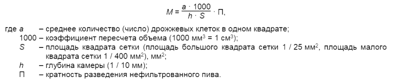

Государственный стандарт Республики Беларусь СТБ 395-2005

# Пиво. Общие технические условия

Издание официальное

УДК 663.41
МКС 67.160.10
КП 03

Ключевые слова: пиво, ячмень пивоваренный, продукты пищевые, показатели физико-химические, показатели органолептические, показатели микробиологические, правила приемки, методы контроля, упаковка, маркировка, транспортирование, хранение

ОКП 91 8422

ОКП РБ 15.96.10.000

## Предисловие

Цели, основные принципы, положения по государственному регулированию и управлению в области технического нормирования и стандартизации установлены Законом Республики Беларусь «О техническом нормировании и стандартизации».

1. РАЗРАБОТАН республиканским унитарным предприятием «Белорусский научно-исследова- тельский и проектно-конструкторский институт пищевых продуктов» (РУП «БелНИИ пищевых продуктов») ВНЕСЕН Белорусским государственным концерном пищевой промышленности «Белгоспищепром»
2. УТВЕРЖДЕН И ВВЕДЕН В ДЕЙСТВИЕ постановлением Госстандарта Республики  Беларусь  от 30 мая 2005 г. № 24
3. ВЗАМЕН СТБ 395-93 (с отменой на территории Республики Беларусь ГОСТ 3473-78)

Дата введения 2006-06-01

## 1. Область применения

Настоящий стандарт распространяется на пиво, получаемое путем сбраживания охмеленного солодового сусла пивными дрожжами.

Требования к пиву, направленные на обеспечение его безопасности для жизни и здоровья населения, изложены в 4.2.9 – 4.2.11.

## 2. Нормативные ссылки

В настоящем стандарте использованы ссылки на следующие стандарты:

РСТ Беларуси 924-92 Настои и композиции водно-спиртовые из растительного сырья. Общие технические условия 
СТБ 1036-97 Продукты пищевые и продовольственное сырье. Методы отбора проб для определения показателей безопасности 
СТБ 1053-98 Радиационный контроль. Отбор проб пищевых продуктов. Общие требования 
СТБ 1100-98 Продукты пищевые. Информация для потребителя. Общие требования 
СТБ 1188-99 Вода питьевая. Общие требования к организации и методам контроля качества 
СТБ 1313-2002 Продукты пищевые и сырье продовольственное. Методика определения содержания токсичных элементов цинка, кадмия, свинца и меди методом инверсионной вольтамперометрии на анализаторах типа ТА 
СТБ 1334-2003 Спирт этиловый ректификованный из пищевого сырья. Технические условия 
СТБ 8019-2002 Система обеспечения единства измерений Республики Беларусь. Товары фасованные. Общие требования к количеству товара 
СТБ ГОСТ Р 52022-2003 Тара стеклянная для пищевой и парфюмерно-косметической продукции. Марки стекла 
ГОСТ 21-94 Сахар-песок. Технические условия 
ГОСТ 22-94 Сахар-рафинад. Технические условия 
ГОСТ 490-79 Кислота молочная пищевая. Технические условия 
ГОСТ 3560-73 Лента стальная упаковочная. Технические условия 
ГОСТ 5060-86 Ячмень пивоваренный. Технические условия 
ГОСТ 5194-91 Патока крахмальная. Технические условия 
ГОСТ 6002-69 Крупа кукурузная. Технические условия 
ГОСТ 6292-93 Крупа рисовая. Технические условия 
ГОСТ 6672-75 Стекла покровные для микропрепаратов. Технические условия 
ГОСТ 7376-89 Картон гофрированный. Общие технические условия 
ГОСТ 7697-82 Крахмал кукурузный. Технические условия 
ГОСТ 7699-78 Крахмал картофельный. Технические условия 
ГОСТ 7933-89 Картон для потребительской тары. Общие технические условия 
ГОСТ 8050-85 Двуокись углерода газообразная и жидкая. Технические условия 
ГОСТ 9078-84 Поддоны плоские. Общие технические условия 
ГОСТ 9218-86 Цистерны для пищевых жидкостей, устанавливаемые на автотранспортные средства. Технические условия 
ГОСТ 9353-90 Пшеница. Требования при заготовках и поставках 
ГОСТ 10117.1-2001 Бутылки стеклянные для пищевых жидкостей. Общие технические условия 
ГОСТ 10117.2-2001 Бутылки стеклянные для пищевых жидкостей. Типы, параметры и основные размеры 
ГОСТ 10354-82 Пленка полиэтиленовая. Техническая условия 
ГОСТ 10444.12-88 Продукты пищевые. Метод определения дрожжей и плесневых грибов 
ГОСТ 10444.15-94 Продукты пищевые. Методы определения количества мезофильных аэробных и факультативно анаэробных микроорганизмов 
ГОСТ 12786-80 Пиво. Правила приемки и методы отбора проб 
ГОСТ 12787-81 Пиво. Методы определения спирта, действительного экстракта и расчет сухих веществ в начальном сусле 
ГОСТ 12788-87 Пиво. Методы определения кислотности 
ГОСТ 12789-87 Пиво. Методы определения цвета 
ГОСТ 12790-81 Пиво. Методы определения двуокиси углерода и стойкости 
ГОСТ 13516-86 Ящики из гофрированного картона для консервов, пресервов и пищевых жидкостей. Технические условия 
ГОСТ 14192-96 Маркировка грузов 
ГОСТ 16990-88 Рожь. Требования при заготовках и поставках 
ГОСТ 18251-87 Лента клеевая на бумажной основе. Технические условия 
ГОСТ 19792-87 Мед натуральный. Технические условия 
ГОСТ 20477-86 Лента полиэтиленовая с липким слоем. Технические условия 
ГОСТ 21946-76 Хмель-сырец. Технические условия 
ГОСТ 21947-76 Хмель-прессованный. Технические условия 
ГОСТ 22983-88 Просо. Требования при заготовках и поставках 
ГОСТ 23285-78 Пакеты транспортные для пищевых продуктов и стеклянной тары. Технические условия 
ГОСТ 24104-2001 Весы лабораторные. Общие технические требования 
ГОСТ 24831-81 Тара-оборудование. Типы, основные параметры и размеры 
ГОСТ 24597-81 Пакеты таро-штучных грузов. Основные параметры и размеры 
ГОСТ 25336-82 Посуда и оборудование лабораторные стеклянные. Типы, основные параметры и размеры 
ГОСТ 25776-83 Продукция штучная в потребительской таре. Упаковка групповая в термоусадочную пленку 
ГОСТ 25951-83 Пленка полиэтиленовая термоусадочная. Технические условия 
ГОСТ 26381-84 Поддоны плоские одноразового использования. Общие технические условия 
ГОСТ 26663-85 Пакеты транспортные. Формирование с применением средств пакетирования. Общие технические требования 
ГОСТ 26668-85 Продукты пищевые и вкусовые. Методы отбора проб для микробиологических анализов 
ГОСТ 26669-85 Продукты пищевые и вкусовые. Подготовка проб для микробиологических анализов 
ГОСТ 26670-91 Продукты пищевые. Методы культивирования микроорганизмов 
ГОСТ 26927-86 Сырье и продукты пищевые. Методы определения ртути 
ГОСТ 26929-94 Сырье и продукты пищевые. Подготовка проб. Минерализация для определения содержания токсичных элементов 
ГОСТ 26930-86 Сырье и продукты пищевые. Метод определения мышьяка 
ГОСТ 26932-86 Сырье и продукты пищевые. Методы определения свинца 
ГОСТ 26933-86 Сырье и продукты пищевые. Методы определения кадмия 
ГОСТ 28538-90 Концентрат квасного сусла, концентраты и экстракты квасов. Технические условия 
ГОСТ 28673-90 Овес. Требования при заготовках и поставках 
ГОСТ 29227-91 (ИСО 835-1-81) Посуда лабораторная стеклянная. Пипетки градуированные. Часть 1. Общие требования 
ГОСТ 29272-92 Солод ржаной сухой. Технические условия 
ГОСТ 29294-92 Солод пивоваренный ячменный. Технические условия 
ГОСТ 30060-93 Пиво. Методы определения органолептических показателей и объема продукции 
ГОСТ 30178-96 Сырье и продукты пищевые. Атомно-абсорбционный метод определения токсичных элементов 
ГОСТ 30518-97 Продукты пищевые. Методы выявления и определения количества бактерий группы кишечных палочек (колиформных бактерий) 
ГОСТ 30519-97 Продукты пищевые. Методы выявления бактерий рода Salmonella 
ГОСТ 30538-97 Продукты пищевые. Методика определения токсичных элементов атомно-эмиссионным методом

Примечание – При пользовании настоящим стандартом проверить действие технического нормативного правового акта (далее – ТНПА) по каталогу, составленному по состоянию на 1 января текущего года, и по соответствующим информационным указателям, опубликованным в текущем году. Если ссылочные ТНПА заменены (изменены), то при пользовании настоящим стандартом следует руководствоваться замененными (измененными) ТНПА. Если ссылочные ТНПА отменены без замены, то положение, в котором дана ссылка на них, применяется в части, не затрагивающей эту ссылку.

## 3. Классификация

Классификацию пива осуществляют по трем признакам: цвет, массовая доля сухих веществ в начальном сусле, способ обработки.

3.1 В зависимости от цвета пиво подразделяют на три типа: светлое, полутемное, темное.

3.2 В зависимости от массовой доли сухих веществ в начальном сусле пиво подразделяют на 8 %-, 23 %-ное.

3.3 В зависимости от способа обработки пиво подразделяют на осветленное и неосветленное, непастеризованное и пастеризованное.

## 4. Общие технические требования

4.1. Пиво должно соответствовать требованиям настоящего стандарта и изготовляться по технологическим инструкциям на конкретные наименования пива с соблюдением санитарных правил для предприятий пивоваренной и безалкогольной промышленности, утвержденных в установленном порядке.

Требования к количеству пива, содержащегося в упаковочных единицах, к его маркировке и упаковке по СТБ 8019.

4.2. Характеристики

4.2.1. По органолептическим показателям пиво должно соответствовать требованиям, указанным в [таблице 1](#t1).

4.2.2 По физико-химическим показателям пиво должно соответствовать требованиям, указанным в [таблице 2](#t2).

4.2.3 По физико-химическим показателям светлое пиво должно соответствовать требованиям, указанным в [таблице 3](#t3).

4.2.4 По физико-химическим показателям полутемное пиво должно соответствовать требованиям, указанным в [таблице 4](#t4).

4.2.5 По физико-химическим показателям темное пиво должно соответствовать требованиям, указанным в [таблице 5](#t5).

4.2.6 Пищевая ценность пива приведена в [таблице 6](#t6).

4.2.7 Допускаемое отклонение от значения массовой доли сухих веществ в начальном сусле, установленное для пива конкретного наименования, – ± 0,5 %.

4.2.8 Конкретные характеристики органолептических показателей, значения физико-химических показателей и пищевую ценность устанавливают для каждого наименования пива в технологических инструкциях по изготовлению пива, согласованных с Министерством здравоохранения Республики Беларусь и утвержденных в установленном порядке. Конкретные значения физико-химических показателей должны соответствовать значениям, установленным в таблицах 1 – 5.

4.2.9 Продолжительность процесса брожения и дображивания устанавливают для каждого наименования пива в технологической инструкции, согласованной с Министерством здравоохранения Республики Беларусь и утвержденной в установленном порядке.

4.2.10 Содержание токсичных элементов и N-нитрозаминов в пиве не должно превышать допустимых уровней, установленных в [[1](#f1)].

4.2.11 По микробиологическим показателям пиво должно соответствовать требованиям, указанным в [таблице 7](#t7).

4.2.12 Содержание радионуклидов в пиве не должно превышать республиканских допустимых уровней, утвержденных Министерством здравоохранения Республики Беларусь [[2](#f2)].

4.3 Требования к сырью и материалам

4.3.1 Для изготовления пива применяют следующее сырье и материалы:

 * сахар-песок по ГОСТ 21;
 * сахар-рафинад по ГОСТ 22;
 * кислоту молочную пищевую по ГОСТ 490;
 * ячмень пивоваренный по ГОСТ 5060, [[3](#f3)];
 * патоку крахмальную по ГОСТ 5194;
 * крупу кукурузную по ГОСТ 6002;
 * крупу рисовую по ГОСТ 6292;
 * крахмал кукурузный по ГОСТ 7697;
 * крахмал картофельный по ГОСТ 7699;
 * двуокись углерода по ГОСТ 8050;
 * воду питьевую по СТБ 1188, [[4](#f4)];
 * пшеницу по ГОСТ 9353;
 * рожь по ГОСТ 16990;
 * мед натуральный по ГОСТ 19792;
 * хмель-сырец по ГОСТ 21946;
 * хмель-прессованный по ГОСТ 21947;
 * просо по ГОСТ 22983;
 * концентрат квасного сусла, концентраты и экстракты квасов по ГОСТ 28538;
 * овес по ГОСТ 28673;
 * солод ржаной сухой по ГОСТ 29272;
 * солод пивоваренный ячменный по ГОСТ 29294;
 * солод пивоваренный ячменный меланоидиновый по [[5](#f5)];
 * чистые культуры пивных дрожжей по удостоверению о качестве, выданному лабораторией, соответствующей требованиям Системы аккредитации Республики Беларусь или Систем аккредитации других государств;
 * колер сахарный по [[6](#f6)];
 * настои и композиции водно-спиртовые из растительного сырья по РСТ Беларуси 924;
 * кислоту аскорбиновую по [[7](#f7)];
 * специальный солод, пивоваренный тритикалевый солод, солодовый и ржаной экстракт, солодовую муку, жжёный ячмень, красящее пиво, гранулированный хмель, хмелепродукты, пищевые из растительного сырья экстракты, растительное сырье по ТНПА;
 * сахаристые продукты, сахаристые крахмалопродукты, натуральную текстурированную ячменную или пшеничную муку по ТНПА;
 * хлорид (сульфат) кальция, молочную пищевую кислоту, натуральные ароматизаторы, ферментные препараты, антиоксиданты (антиокислители), регуляторы кислотности, стабилизирующие средства (силикагели, поливинилполипирролидон и пр.), осветлители, дрожжевые подкормки, пищевые добавки по ТНПА.

Допускается применение других видов зерна и продуктов его переработки (муки, крупы и др.) по ТНПА и (или) разрешенных для применения в пищевой промышленности Министерством здравоохранения Республики Беларусь.

Допускается применение указанного сырья и материалов по другим ТНПА и (или) разрешенных для применения в пищевой промышленности Министерством здравоохранения Республики Беларусь по показателям качества не хуже требований, указанных в ссылочных ТНПА данного стандарта.

Использование ферментных препаратов, антиоксидантов, стабилизирующих средств, осветлителей, дрожжевых подкормок разрешается при наличии технологической инструкции по их применению, согласованной с Министерством здравоохранения Республики Беларусь, утвержденной в установленном порядке и действующей на территории Республики Беларусь.

Примечание – Рекомендуемые требования к качеству солода пивоваренного ячменного устанавливают в договоре (контракте) между поставщиком и покупателем, но не хуже требований, указанных в ГОСТ 29294.

4.3.2 По показателям безопасности применяемое сырье должно соответствовать допустимым уровням, установленным [[1](#f1)], [[4](#f4)].

4.3.3 По показателям безопасности применяемые пищевые добавки должны соответствовать допустимым уровням, установленным [[8](#f8)].

4.3.4 Содержание радионуклидов в сырье не должно превышать республиканских допустимых уровней [[9](#f9)].

4.4 Упаковка

4.4.1 Пиво разливают в:

 * бутылки стеклянные (коричневого или зеленого цвета) по ГОСТ 10117.1 и ГОСТ 10117.2 типа Ха и типа Хб или по ТНПА, изготовленные из стекла марок и химического состава по СТБ ГОСТ Р 52022;
 * бутылки (коричневого цвета) одноразового использования из полимерных материалов (далее – ПЭТ-бутылки), металлические банки (далее – банки), металлические емкости из нержавеющей стали многоразового использования – кеги (далее – кеги) по ТНПА;
 * цистерны – по ГОСТ 9218 или по ТНПА.

4.4.2 ПЭТ-бутылки должны изготовляться из полиэтилентерефталата по ТНПА.

4.4.3 Банки должны изготовляться из нержавеющей стали или пищевого алюминия по ТНПА.

4.4.4 Кеги должны изготовляться из нержавеющей стали по ТНПА.

4.4.5 Допускается розлив пива в другие виды тары по ТНПА и (или) разрешенной для контакта с пищевыми продуктами Министерством здравоохранения Республики Беларусь при условии выполнения требований, указанных в разделах 5 – 7.

4.4.6 Пределы допускаемых отрицательных отклонений содержимого потребительской тары и кег от номинального объема в соответствии с СТБ 8019.

4.4.7 Пределы допускаемых положительных отклонений содержимого потребительской тары и кег от номинального объема не ограничиваются.

4.4.8 Степень заполнения автоцистерн должна быть в пределах 98 % – 99 % от их полной вместимости.

4.4.9 Стеклянные бутылки с пивом укупоривают кроненпробками по ТНПА.

Допускается применять литографированные и конгревированные кроненпробки.

4.4.10 ПЭТ-бутылки с пивом укупоривают полимерными колпачками по ТНПА.

4.4.11 Банки с пивом укупоривают крышками из пищевого алюминия по ТНПА.

4.4.12 Кеги после заполнения должны быть герметичны.

4.4.13 Цистерны после заполнения должны быть плотно закрыты и опломбированы.

4.4.14 При розливе пива в другие виды тары, ее плотно закрывают с применением укупорочных средств по ТНПА.

4.4.15 Допускается применение других укупорочных средств по ТНПА и (или) разрешенных для контакта с пищевыми продуктами Министерством здравоохранения Республики Беларусь при условии выполнения требований, указанных в разделах 5 – 7.

4.4.16 Стеклянные бутылки укладывают в ящики из картона гофрированного по ГОСТ 13516, в тару-оборудование по ГОСТ 24831, в проволочные, металлические, пластмассовые ящики и металлические складные ящичные поддоны по ТНПА.

Соединение стыков клапанов и крышки дна ящиков из гофрированного картона проводят лентой клеевой на бумажной основе по ГОСТ 18251, лентой полиэтиленовой с липким слоем по ГОСТ 20477, горячеплавким клеем по ТНПА и (или) разрешенным к применению Министерством здравоохранения Республики Беларусь или прошиванием проволочно-швейной машиной.

4.4.17 Стеклянные бутылки, ПЭТ-бутылки и банки упаковывают в художественно оформленные сувенирные коробки по ТНПА, в пленку полиэтиленовую термоусадочную по ГОСТ 25951 без прокладочных средств, на лотки или прокладки из картона гофрированного по ГОСТ 7376 или картона по ГОСТ 7933. Упаковку осуществляют в соответствии с требованиями ГОСТ 25776.

Допускается изготовление лотков из других материалов по ТНПА по показателям прочности не хуже указанных в ГОСТ 7933.

4.4.18 При необходимости продукцию, упакованную в термоусадочную пленку, формируют в пакеты транспортные на плоских поддонах по ГОСТ 9078 или ГОСТ 26381.

Для скрепления транспортных пакетов применяют пленку полиэтиленовую по ГОСТ 10354, пленку полиэтиленовую термоусадочную по ГОСТ 25951, ленту стальную по ГОСТ 3560, полипропиленовую ленту или растягивающуюся пленку по ТНПА.

4.4.19 Пакетирование на поддонах производят в соответствии с ГОСТ 23285, ГОСТ 24597 и ГОСТ 26663. При формировании транспортных пакетов с помощью термоусадочной пленки не допускается

сварка ее с пленкой упаковки.

4.4.20 ПЭТ-бутылки упаковывают в тару-оборудование по ГОСТ 24831, металлические складные поддоны по ТНПА.

4.4.21 Пиво, отгружаемое для розлива на другие предприятия, разливают в тару по ТНПА.

4.4.22 Транспортная и потребительская тара должна обеспечивать качество, безопасность и сохранность продукта в процессе его изготовления, транспортирования, хранения и реализации

4.5 Маркировка

4.5.1 Информацию наносят в виде текста, цифровых, цветовых и условных обозначений на потребительскую тару, этикетку, контрэтикетку, кольеретку, ярлык, пробку.

Этикетка, контрэтикетка, кольеретка должны соответствовать требованиям ТНПА.

4.5.2 Маркировка потребительской тары по СТБ 1100 с указанием:

 * наименования и местонахождения (юридического адреса, включая страну) изготовителя;
 * наименования и типа пива;
 * товарного знака изготовителя (при наличии);
 * массовой доли сухих веществ в начальном сусле, %;
 * минимального значения объемной доли спирта или фактически достигнутого значения объемной доли спирта, но не ниже установленного настоящим стандартом, % («алк. не менее ... % об.» или «спирт не менее ... % об.»);
 * состава пива;
 * даты изготовления и срока годности;
 * условий хранения;
 * номинального объема, л (дм3);
 * надписи: «Пастеризованное» (для пастеризованного пива), «неосветленное» (для неосветленного пива);
 * пищевой ценности 100 г пива;
 * информации о сертификации;
 * обозначения настоящего стандарта;
 * штрих-кода.

4.5.2.1 На лицевой стороне этикетки наносят в виде текста:

 * наименование и местонахождение (юридического адреса, включая страну) изготовителя;
 * наименование и тип пива;
 * минимальное значение объемной доли спирта или фактически достигнутое значение объемной доли спирта, но не ниже установленного настоящим стандартом, % («алк. не менее % об.» или «спирт не менее % об.»);
 * номинальный объем, л (дм3);
 * надпись: «Пастеризованное» (для пастеризованного пива), «Неосветленное» (для неосветленного пива).

4.5.2.2 Дату изготовления и срок годности наносят черным цветом на белом (светлом) фоне.

4.5.3 На каждый кег с пивом должна быть наклеена этикетка с указанием:

 * наименования и местонахождения (юридического адреса, включая страну) изготовителя;
 * наименования и типа пива;
 * товарного знака изготовителя (при наличии);
 * массовой доли сухих веществ в начальном сусле, %;
 * минимального значения объемной доли спирта или фактически достигнутого значения объемной доли спирта, но не ниже установленных настоящим стандартом, % («алк. не менее ... % об.» или «спирт не менее ... % об.»);
 * состава пива;
 * даты изготовления и срока годности;
 * условий хранения;
 * массы брутто, массы нетто или номинального объема, л (дм3);
 * надписи: «Пастеризованное» (для пастеризованного пива);
 * пищевой ценности 100 г пива;
 * информации о сертификации;
 * обозначения настоящего стандарта;
 * штрих-кода.

4.5.4 На каждую цистерну с пивом прикрепляют ярлык с указанием:

 * наименования и местонахождения (юридического адреса, включая страну) изготовителя;
 * наименования и типа пива;
 * массовой доли сухих веществ в начальном сусле, %;
 * минимального значения объемной доли спирта или фактически достигнутого значения объемной доли спирта, но не ниже установленного настоящим стандартом, % («алк. не менее ... % об.» или «спирт не менее ... % об.»);
 * состава пива;
 * даты изготовления и срока годности;
 * номинального объема, л (дм3);
 * надписи: «Неосветленное» (для неосветленного пива);
 * пищевой ценности 100 г пива;
 * условий хранения;
 * информации о сертификации;
 * обозначения настоящего стандарта;
 * штрих-кода.

4.5.5 Маркировка транспортной тары и тары-оборудования по ГОСТ 14192 с нанесением манипуляционного знака «Хрупкое. Осторожно», «Верх» и указанием:

 * наименования и местонахождения (юридического адреса, включая страну) изготовителя;
 * наименования и типа пива;
 * массовой доли сухих веществ в начальном сусле, %;
 * даты изготовления и срока годности;
 * условий хранения;
 * номинального объема в единице потребительской тары, л (дм3);
 * количества единиц потребительской тары в единице транспортной тары (для ящиков);
 * надписи: «Пастеризованное» (для пастеризованного пива);
 * обозначения настоящего стандарта;
 * штрих-кода.

4.5.6 При согласовании с продавцом допускается не наносить маркировку транспортной тары по ГОСТ 14192.

## 5. Правила приемки

5.1 Правила приемки – по ГОСТ 12786.

Каждая партия пива должна быть проверена отделом технохимического контроля (лабораторией) изготовителя на соответствие требованиям настоящего стандарта и должна сопровождаться документом о качестве с указанием:

 * номера и даты выдачи документа о качестве;
 * наименования и местонахождения (юридического адреса, включая страну) изготовителя;
 * наименования и типа пива;
 * объема продукта в партии;
 * даты изготовления и (или) срока годности;
 * условий хранения;
 * результатов испытаний по органолептическим и физико-химическим показателям;
 * вида тары и упаковки;
 * количества упаковочных единиц;
 * подтверждения о соответствии качества продукта требованиям настоящего стандарта;
 * информации о сертификации;
 * обозначения настоящего стандарта.

Документ о качестве должен быть заверен подписями ответственных лиц и печатью (штампом).

5.2 Контроль органолептических и физико-химических показателей, номинального объема, состояния упаковки и правильности маркировки осуществляют в каждой партии в соответствии со схемой технохимического контроля, согласованной и утвержденной в установленном порядке.

В схеме технохимического контроля должны быть предусмотрены действия в соответствии с ГОСТ 12786 при получении неудовлетворительных результатов испытаний.

5.3 Контроль содержания токсичных элементов, микробиологических показателей, стойкости осуществляют в соответствии с порядком, установленным изготовителем продукта по согласованию с органами государственного санитарного надзора и гарантирующим безопасность продукта.

5.4 Контроль за уровнем радиоактивного загрязнения продукта осуществляют в соответствии со схемой радиационного контроля, согласованной и утвержденной в установленном порядке.

В схеме радиационного контроля должны быть предусмотрены действия при обнаружении превышения допустимых уровней содержания радионуклидов в продукте, а также действия при признании продукта непригодным для пищевых целей.

5.5 Контроль N-нитрозаминов осуществляют в соответствии с порядком, установленным изготовителем продукта по согласованию с органами государственного санитарного надзора и гарантирующим безопасность продукта, но не реже одного раза в год.

6 Методы контроля

6.1 Отбор проб – по ГОСТ 12786, отбор и подготовка проб для определения показателей безопасности и радиационного контроля – по ГОСТ 26929, СТБ 1036, СТБ 1053, отбор, подготовка проб и культивирование микроорганизмов для определения микробиологических показателей – по ГОСТ 26668, ГОСТ 26669, ГОСТ 26670.

6.2 Методы испытаний – по ГОСТ 12788, ГОСТ 12789, ГОСТ 12790, [[10](#f10)], ГОСТ 30060 и методикам выполнения измерений, утвержденным в установленном порядке.

Массовую долю спирта определяют по ГОСТ 12787.

Объемную долю спирта в процентах Vc рассчитывают по формуле

6.3 Содержание токсичных элементов определяют по СТБ 1313, ГОСТ 26927, ГОСТ 26930, ГОСТ 26932, ГОСТ 26933, ГОСТ 30178, ГОСТ 30538.

6.4 Определение N-нитрозаминов – по методикам, утвержденным в установленном порядке.

6.5 Микробиологический контроль проводят по ГОСТ 10444.12, ГОСТ 10444.15, ГОСТ 30518, ГОСТ 30519 и методикам, утвержденным в установленном порядке.

6.6 Содержание радионуклидов определяют по методикам выполнения измерений, утвержденным в установленном порядке.

6.7 Состояние упаковки и правильность маркировки транспортной и потребительской тары определяют визуально и по ГОСТ 30060, путем осмотра каждой отобранной единицы тары по ГОСТ 12786.

6.8 Определение количества дрожжевых клеток в 1 см3 неосветленного пива

6.8.1 Сущность метода

Сущность метода заключается в определении количества дрожжевых клеток в 1 см3 неосветленного пива под микроскопом в счетной камере Горяева.

6.8.2 Аппаратура, материалы, реактивы

Микроскоп биологический МБИ, МБР или другой по [[11](#f11)] или ТНПА;

Осветитель к микроскопу ОИ-19;

Стекла покровные для микропрепаратов по ГОСТ 6672;

Камера для счета форменных элементов крови и клеточных элементов спинно-мозговой жидкости (камера Горяева) или другая по ТНПА.

Колба П-1-250-29/32 ТС или других размеров по ГОСТ 25336;

Колба П-2-250-34 ТХС или других размеров по ГОСТ 25336;

Пробирка П1-16-150 ХС или других размеров по ГОСТ 25336;

Пробирка П2-10-90 ХС или других размеров по ГОСТ 25336;

Пипетки градуированные по ГОСТ 29227;

Спирт этиловый ректификованный из пищевого сырья по СТБ 1334;

Вода питьевая по СТБ 1188, [[2](#f2)].

6.8.3 Подготовка к испытанию

Перед проведением подсчета клеток счетную камеру Горяева и покровное стекло моют и обезжиривают. Для обезжиривания стекло обрабатывают хромовой смесью, а затем ополаскивают водой.

Чистые предметные стекла хранят в банке со спиртом.

С помощью микроскопа ориентировочно определяют количество дрожжевых клеток в анализируемой пробе неосветленного пива. Если в большом квадрате сетки камеры Горяева количество дрожжевых клеток превышает 20, то пробу разводят в соответствии с ГОСТ 26669 питьевой водой при температуре 20°С.

6.8.4 Проведение испытания

Отобранную пробу перед микроскопированием встряхивают. Подсчет дрожжевых клеток проводят под микроскопом в камере Горяева.

Каплю неосветленного пива наносят на поверхность счетной камеры и покрывают шлифованным покровным стеклом. Подсчет клеток начинают через 3 – 5 мин после заполнения камеры для того, чтобы клетки осели и были видны под микроскопом в одной плоскости. Подсчитывают клетки в 10 больших квадратах сетки камеры, перемещая их по диагонали сетки. Учитывают все клетки, лежащие в квадрате сетки, а также пересекающие верхнюю и правую стороны квадрата.

6.8.5 Обработка результатов

Количество дрожжевых клеток М в 1 см3 неосветленного пива вычисляют по формуле

Вычисление проводят до второго десятичного знака. За результат испытаний принимают среднее арифметическое результатов двух параллельных измерений и выражают целым числом с двумя десятичными знаками с последующим округлением до одного десятичного знака. Расхождение между результатами двух измерений, выполненных в разных лабораториях, для одной и той же партии не должно превышать 7 %. Результат выражают в миллионах клеток в сантиметре кубическом.

6.9 Допускается определение количества дрожжевых клеток в 1 см3 неосветленного пива при помощи счетчика дрожжевых клеток по другим методикам, утвержденным в установленном порядке.

6.10 Определение номинального объема пива, разлитого в ПЭТ-бутылки и банки

6.10.1 Сущность метода

Сущность метода заключается в определении объема пива, разлитого в ПЭТ-бутылки и банки без открывания ПЭТ-бутылок и банок.

6.10.2 Аппаратура, материалы, реактивы

Весы лабораторные общего назначения по ГОСТ 24104 с пределами взвешивания, соответствующими определяемой массе, с допускаемой погрешностью взвешивания ± 375 мг.

Допускается использование других средств измерения, имеющих аналогичные метрологическиехарактеристики.

6.10.3 Проведение испытания

Отбирают пустые ПЭТ-бутылки (банки) вместе с пробкой в количестве 10 шт и взвешивают на лабораторных весах с точностью до 1,0 г.

Помечают каждую взвешенную ПЭТ-бутылку (банку).

Помеченные ПЭТ-бутылки (банки) заполняют пивом на линии розлива.

Помеченные ПЭТ-бутылки (банки), заполненные пивом, взвешивают на лабораторных весах с точностью до 1,0 г.

6.10.4 Обработка результатов

Среднюю массу пустой ПЭТ-бутылки (банки) с пробкой у вычисляют по формуле

Среднюю массу ПЭТ-бутылки (банки) с пивом х вычисляют по формуле

Содержимое упаковочной единицы V в сантиметрах кубических вычисляют по формуле

Отклонение содержимого упаковочной единицы Z от номинального объема в процентах вычисляют по формуле (6).

## 7. Транспортирование и хранение

7.1 Пиво транспортируют всеми видами транспорта в соответствии с Правилами перевозок грузов, действующими на соответствующем виде транспорта.

Пиво в таре-оборудовании и контейнерах транспортируют автомобильным транспортом. Перевозку автомобильным транспортом осуществляют в крытых транспортных средствах.

Пакетирование грузов пакетами типа А по ГОСТ 23285, с основными параметрами и размерами – по ГОСТ 24597.

Транспортирование пива в торговые точки, оборудованные стационарными резервуарами, или на базы розлива производят в цистернах по ГОСТ 9218 или другому документу.

7.2 Бутылки с пивом хранят в затемненных, вентилируемых, не имеющих посторонних запахов помещениях.

Температура хранения пива:

 * неосветленного в кегах – от 2 °С до 4 °С;
 * неосветленного в изотермических резервуарах – от 2 °С до 12 °С;
 * непастеризованного – от 2 °С до 12 °С;
 * непастеризованного в изотермических резервуарах – от 2 °С до 12 °С;
 * пастеризованного – от 10 °С до 20 °С.

Пиво, доставленное в цистерне, хранят под давлением двуокиси углерода в изотермических резервуарах при температуре от 2 °С до 5 °С.

7.3 Срок годности пива устанавливает изготовитель продукции с указанием установленных условий хранения. Срок годности для конкретного наименования пива должен соответствовать стойкости пива, указанной в технологической инструкции, согласованной и утвержденной в установленном порядке, и находиться в пределах, установленных настоящим стандартом.

Допускается установление изготовителем продукции стойкости и сроков годности, отличных от предусмотренных настоящим стандартом, при наличии заключения Министерства здравоохранения Республики Беларусь на установленные сроки годности.

7.4 Срок годности пива исчисляют с даты изготовления (розлива).

## Таблицы

### Таблица 1

<table>
<thead>
<tr>
<th rowspan="2">Тип и способ обработки пива</th>
<th colspan="2">Наименование и характеристика показателя</th>
</tr>
<tr>
<th>Внешний вид</th>
<th>Вкус и аромат</th>
</tr>
</thead>
<tbody>
<tr>
<td>Пиво светлое, полутемное осветленное</td>
<td>Прозрачная пенящаяся жидкость без осадка и посторонних включений</td>
<td>Вкус сброженного солодового напитка, чистый, полный, гармоничный, с мягкой связанной хмелевой горечью и свежим хмелевым ароматом, без посторонних привкуса и запаха</td>
</tr>
<tr>
<td>Пиво светлое, полутемное неосветленное</td>
<td>Непрозрачная пенящаяся жидкость без посторонних включений. Допускается наличие дрожжевого осадка</td>
<td>Вкус сброженного солодового напитка, чистый, полный, гармоничный, с мягкой связанной хмелевой горечью и свежим хмелевым ароматом. Допускается слабый дрожжевой аромат и привкус</td>
</tr>
<tr>
<td>Пиво темное осветленное</td>
<td>Прозрачная пенящаяся жидкость без осадка и посторонних включений</td>
<td>Вкус сброженного солодового напитка, чистый, солодовый, с ярко выраженным вкусом специального солода, с легкой хмелевой горечью и солодовым ароматом, без посторонних привкуса и запаха. Для пива с массовой долей сухих веществ в на- чальном сусле 14 % и выше характерен винный привкус</td>
</tr>
<tr>
<td>Пиво темное неосветленное</td>
<td>Непрозрачная пенящаяся жидкость без посторонних включений. Допускается наличие дрожжевого осадка</td>
<td>Вкус сброженного солодового напитка, чистый, солодовый, с ярко выраженным вкусом специального солода, с легкой хмелевой горечью и солодовым ароматом. Допускается слабый дрожжевой аромат и привкус. Для пива с массовой долей сухих веществ в начальном сусле 14 % и выше характерен винный привкус</td>
</tr>
</tbody>
</table>

### Таблица 2

<table>
<thead>
<tr>
<th rowspan="2">Наименование показателя</th>
<th colspan="2">Значение</th>
</tr>
<tr>
<th>осветленного пива</th>
<th>неосветленного пива</th>
</tr>
</thead>
<tbody>
<tr>
<td>Высота пены, мм, не менее: 
– для пива в потребительской таре 
– для разливного пива</td>
<td>&nbsp; 20 15</td>
<td>&nbsp; 20 15</td>
</tr>
<tr>
<td>Пеностойкость, мин, не менее: 
– для пива в потребительской таре 
– для разливного пива</td>
<td>&nbsp; 2,0 1,5</td>
<td>&nbsp; 2,0 1,5</td>
</tr>
</tbody>
</table>

### Таблица 3

<table>
<thead>
<tr>
<th rowspan="2">Наименование показателя для светлого пива</th>
<th colspan="16">Массовая доля сухих веществ в начальном сусле, %</th>
</tr>
<tr>
<th>8</th>
<th>9</th>
<th>10</th>
<th>11</th>
<th>12</th>
<th>13</th>
<th>14</th>
<th>15</th>
<th>16</th>
<th>17</th>
<th>18</th>
<th>19</th>
<th>20</th>
<th>21</th>
<th>22</th>
<th>23</th>
</tr>
<tr>
<th>Объемная доля спирта, %, не менее</th>
<th>2,8</th>
<th>3,2</th>
<th>3,6</th>
<th>3,7</th>
<th>4,2</th>
<th>4,7</th>
<th>4,8</th>
<th>5,1</th>
<th>5,8</th>
<th>6,2</th>
<th>6,8</th>
<th>7,1</th>
<th>7,9</th>
<th>8,2</th>
<th>8,6</th>
<th>9,4</th>
</tr>
</thead>
<tbody>
<tr>
<td>Кислотность, см3 раствора гидроокиси натрия концентрацией 1 моль/дм3 на 100 см3 пива</td>
<td colspan="2" style="text-align: center;">0,8 – 2,5</td>
<td style="text-align: center;" colspan="2">1,0 – 2,8</td>
<td style="text-align: center;" colspan="2">1,0 – 3,3</td>
<td style="text-align: center;" colspan="2">1,5 – 3,8</td>
<td style="text-align: center;" colspan="2">2,0 – 4,5</td>
<td colspan="6" style="text-align: center;">2,5 – 5,0</td>
</tr>
<tr>
<td>Цвет, см3 раствора йода концентрацией 0,1 моль/дм3 на 100 см3 воды</td>
<td colspan="16" style="text-align: center;">0,2 – 1,8</td>
</tr>
<tr>
<td>Массовая доля двуокиси углерода, %, не менее</td>
<td colspan="16" style="text-align: center;">0,30</td>
</tr>
<tr>
<td>Стойкость, сут:</td>
<td colspan="16">&nbsp;</td>
</tr>
<tr>
<td>–непастеризованного неосветленного в изотермических резервуарах</td>
<td colspan="16" style="text-align: center;">2 – 5</td>
</tr>
<tr>
<td>– непастеризованного неосветленного</td>
<td colspan="16" style="text-align: center;">5 – 7</td>
</tr>
<tr>
<td>– непастеризованного осветленного</td>
<td colspan="16" style="text-align: center;">8 – 30</td>
</tr>
<tr>
<td>– непастеризованного осветленного с применением стабилизирующих средств</td>
<td colspan="16" style="text-align: center;">15 – 60</td>
</tr>
<tr>
<td>– пастеризованного осветленного и неосветленного</td>
<td colspan="16" style="text-align: center;">15 – 90</td>
</tr>
<tr>
<td>– пастеризованного осветленного с применением стабилизирующих средств</td>
<td colspan="16" style="text-align: center;">30 – 180</td>
</tr>
<tr>
<td>– разлитого холодно-стерильным способом</td>
<td colspan="16" style="text-align: center;">30 – 60</td>
</tr>
<tr>
<td>– разлитого холодно-стерильным способом с применением стабилизирующих средств</td>
<td colspan="16" style="text-align: center;">30 – 180</td>
</tr>
<tr>
<td colspan="17">Примечания: 1 Массовую долю двуокиси углерода определяют в пиве, разлитом в бутылки и металлические банки. 2 Стойкость пива исчисляют с даты изготовления (розлива).</td>
</tr>
</tbody>
</table>

### Таблица 4

<table>
<thead>
<tr>
<th rowspan="2">Наименование показателя для полутемного пива</th>
<th colspan="14">Массовая доля сухих веществ в начальном сусле, %</th>
</tr>
<tr>
<th>10</th>
<th>11</th>
<th>12</th>
<th>13</th>
<th>14</th>
<th>15</th>
<th>16</th>
<th>17</th>
<th>18</th>
<th>19</th>
<th>20</th>
<th>21</th>
<th>22</th>
<th>23</th>
</tr>
<tr>
<th>Объемная доля спирта, %, не менее</th>
<th>3,5</th>
<th>3,7</th>
<th>4,2</th>
<th>4,4</th>
<th>4,8</th>
<th>5,1</th>
<th>5,4</th>
<th>6,0</th>
<th>6,2</th>
<th>6,8</th>
<th>7,5</th>
<th>8,0</th>
<th>8,6</th>
<th>9,4</th>
</tr>
</thead>
<tbody>
<tr>
<td>Кислотность, см3 раствора гидроокиси натрия концентрацией 1 моль/дм3 на 100 см3 пива</td>
<td>1,0 – 2,8</td>
<td>1,3 – 2,8</td>
<td colspan="2">1,5 – 3,3</td>
<td colspan="2">1,8 – 3,5</td>
<td colspan="2">2,2 – 4,5</td>
<td colspan="6">2,5 – 5,0</td>
</tr>
<tr>
<td>Цвет, см3 раствора йода концентрацией 0,1 моль/дм3 на 100 см3 воды</td>
<td colspan="14" style="text-align: center;">1,9 – 3,5</td>
</tr>
<tr>
<td>Массовая доля двуокиси углерода, %, не менее</td>
<td colspan="14" style="text-align: center;">0,30</td>
</tr>
<tr>
<td>Стойкость, сут:</td>
<td colspan="14"></td>
</tr>
<tr>
<td>– непастеризованного неосветленного в изотермических резервуарах</td>
<td colspan="14" style="text-align: center;">2 – 5</td>
</tr>
<tr>
<td>– непастеризованного неосветленного</td>
<td colspan="14" style="text-align: center;">5 – 7</td>
</tr>
<tr>
<td>– непастеризованного осветленного</td>
<td colspan="14" style="text-align: center;">8 – 30</td>
</tr>
<tr>
<td>– непастеризованного осветленного с применением стабилизирующих средств</td>
<td colspan="14" style="text-align: center;">15 – 60</td>
</tr>
<tr>
<td>– пастеризованного осветленного и неосветленного</td>
<td colspan="14" style="text-align: center;">15 – 90</td>
</tr>
<tr>
<td>– пастеризованного осветленного с применением стабилизирующих средств</td>
<td colspan="14" style="text-align: center;">30 – 180</td>
</tr>
<tr>
<td>– разлитого холодно-стерильным способом</td>
<td colspan="14" style="text-align: center;">30 – 60</td>
</tr>
<tr>
<td>– разлитого холодно-стерильным способом с применением стабилизирующих средств</td>
<td colspan="14" style="text-align: center;">30 – 180</td>
</tr>
<tr>
<td colspan="15">Примечания 1 Массовую долю двуокиси углерода определяют в пиве, разлитом в бутылки и металлические банки. 2 Стойкость пива исчисляют с даты изготовления (розлива).</td>
</tr>
</tbody>
</table>

### Таблица 5

<table>
<thead>
<tr>
<th rowspan="2">Наименование показателя для темного пива</th>
<th colspan="13">Массовая доля сухих веществ в начальном сусле, %</th>
</tr>
<tr>
<th>11</th>
<th>12</th>
<th>13</th>
<th>14</th>
<th>15</th>
<th>16</th>
<th>17</th>
<th>18</th>
<th>19</th>
<th>20</th>
<th>21</th>
<th>22</th>
<th>23</th>
</tr>
<tr>
<th>Объемная доля спирта, %, не менее</th>
<th>3,7</th>
<th>4,1</th>
<th>4,2</th>
<th>4,7</th>
<th>4,9</th>
<th>5,2</th>
<th>5,7</th>
<th>5,9</th>
<th>6,0</th>
<th>6,2</th>
<th>7,4</th>
<th>8,0</th>
<th>9,1</th>
</tr>
</thead>
<tbody>
<tr>
<td>Кислотность, см3 раствора гидроокиси натрия концентрацией 1 моль/дм3 на 100 см3 пива</td>
<td>1,6 – 2,8</td>
<td colspan="2">2,0 – 3,5</td>
<td colspan="2">2,2 – 3,7</td>
<td colspan="2">2,5 – 4,5</td>
<td colspan="6">3,5 – 5,5</td>
</tr>
<tr>
<td>Цвет, см3 раствора йода концентрацией 0,1 моль/дм3 на 100 см3 воды</td>
<td colspan="13" style="text-align: center;">3,6 и более</td>
</tr>
<tr>
<td>Массовая доля двуокиси углерода, %, не менее</td>
<td colspan="13" style="text-align: center;">0,30</td>
</tr>
<tr>
<td>Стойкость, сут:</td>
<td colspan="13">&nbsp;</td>
</tr>
<tr>
<td>– непастеризованного неосветленного в изотермических резервуарах</td>
<td colspan="13" style="text-align: center;">2 – 5</td>
</tr>
<tr>
<td>– непастеризованного неосветленного</td>
<td colspan="13" style="text-align: center;">5 – 7</td>
</tr>
<tr>
<td>– непастеризованного осветленного</td>
<td colspan="13" style="text-align: center;">8 – 30</td>
</tr>
<tr>
<td>– непастеризованного осветленного с применением стабилизирующих средств</td>
<td colspan="13" style="text-align: center;">15 – 60</td>
</tr>
<tr>
<td>– пастеризованного осветленного и неосветленного</td>
<td colspan="13" style="text-align: center;">15 – 90</td>
</tr>
<tr>
<td>– пастеризованного осветленного с применением стабилизирующих средств</td>
<td colspan="13" style="text-align: center;">30 – 180</td>
</tr>
<tr>
<td>– разлитого холодно-стерильным способом</td>
<td colspan="13" style="text-align: center;">30 – 60</td>
</tr>
<tr>
<td>– разлитого холодно-стерильным способом сприменением стабилизирующих средств</td>
<td colspan="13" style="text-align: center;">30 – 180</td>
</tr>
<tr>
<td colspan="14">Примечания 1 Массовую долю двуокиси углерода определяют в пиве, разлитом в бутылки и металлические банки. 2 Стойкость пива исчисляют с даты изготовления (розлива).</td>
</tr>
</tbody>
</table>

### Таблица 6

<table>
<thead>
<tr>
<th rowspan="2">Наименование показателя</th>
<th colspan="16">Массовая доля сухих веществ в начальном сусле, %</th>
</tr>
<tr>
<th>8</th>
<th>9</th>
<th>10</th>
<th>11</th>
<th>12</th>
<th>13</th>
<th>14</th>
<th>15</th>
<th>16</th>
<th>17</th>
<th>18</th>
<th>19</th>
<th>20</th>
<th>21</th>
<th>22</th>
<th>23</th>
</tr>
</thead>
<tbody>
<tr>
<td>Энергетическая ценность 100 г светлого пива, ккал</td>
<td>30</td>
<td>34</td>
<td>38</td>
<td>42</td>
<td>46</td>
<td>50</td>
<td>54</td>
<td>58</td>
<td>62</td>
<td>66</td>
<td>70</td>
<td>74</td>
<td>78</td>
<td>80</td>
<td>82</td>
<td>85</td>
</tr>
<tr>
<td>Углеводы 100 г светлого пива, г, не более</td>
<td>3,5</td>
<td>3,8</td>
<td>4,2</td>
<td>4,6</td>
<td>4,7</td>
<td>5,3</td>
<td>5,8</td>
<td>6,2</td>
<td>6,6</td>
<td>6,9</td>
<td>7,3</td>
<td>7,5</td>
<td>7,6</td>
<td>7,8</td>
<td>8,0</td>
<td>8,3</td>
</tr>
<tr>
<td>Энергетическая ценность 100 г полутемного пива, ккал</td>
<td>–</td>
<td>–</td>
<td>–</td>
<td>42</td>
<td>44</td>
<td>50</td>
<td>54</td>
<td>58</td>
<td>62</td>
<td>66</td>
<td>70</td>
<td>74</td>
<td>78</td>
<td>80</td>
<td>82</td>
<td>85</td>
</tr>
<tr>
<td>Углеводы 100 г полутемного пива, г, не более</td>
<td>–</td>
<td>–</td>
<td>–</td>
<td>4,6</td>
<td>4,9</td>
<td>5,3</td>
<td>5,9</td>
<td>6,3</td>
<td>6,8</td>
<td>7,1</td>
<td>7,6</td>
<td>7,9</td>
<td>7,8</td>
<td>8,0</td>
<td>8,1</td>
<td>8,3</td>
</tr>
<tr>
<td>Энергетическая ценность 100 г темного пива, ккал</td>
<td>–</td>
<td>–</td>
<td>–</td>
<td>42</td>
<td>46</td>
<td>50</td>
<td>54</td>
<td>58</td>
<td>62</td>
<td>66</td>
<td>71</td>
<td>75</td>
<td>79</td>
<td>82</td>
<td>84</td>
<td>83</td>
</tr>
<tr>
<td>Углеводы 100 г темного пива, г, не более</td>
<td>–</td>
<td>–</td>
<td>–</td>
<td>4,6</td>
<td>5,0</td>
<td>5,7</td>
<td>5,9</td>
<td>6,6</td>
<td>7,2</td>
<td>7,4</td>
<td>8,1</td>
<td>8,8</td>
<td>8,7</td>
<td>8,8</td>
<td>8,9</td>
<td>8,6</td>
</tr>
<tr>
<td colspan="17">Примечание – Показатели, приведенные в таблице 6, являются информационными.</td>
</tr>
</tbody>
</table>

### Таблица 7

<table>
<thead>
<tr>
<td rowspan="2">Классификация пива</td>
<td rowspan="2">КМАФАнМ, КОЕ/г, не более</td>
<td colspan="2">Масса продукта, г, в которой не допускаются</td>
<td rowspan="2">Дрожжи и плесени, КОЕ/г, не более (сумма)</td>
<td rowspan="2">Количество дрожжевых клеток, млн. клеток/см3, не более</td>
</tr>
</thead>
<tbody>
<tr>
<td>БГКП (колиформы)</td>
<td>Патогенные, в том числе сальмонеллы</td>
</tr>
<tr>
<td>Пиво непастеризованное осветленное в потребительской таре с массовой долей сухих веществ в начальном сусле: 8 % – 11 % 12 % и более</td>
<td>– –</td>
<td>3,0 10,0</td>
<td>25,0 25,0</td>
<td>– –</td>
<td>– –</td>
</tr>
<tr>
<td>Пиво пастеризованное осветленное в потребительской таре</td>
<td>500,0</td>
<td>10,0</td>
<td>25,0</td>
<td>40,0</td>
<td>–</td>
</tr>
<tr>
<td>Пиво разливное</td>
<td>–</td>
<td>1,0</td>
<td>25,0</td>
<td>–</td>
<td>–</td>
</tr>
<tr>
<td>Пиво непастеризованное неосветленное в потребительской таре с массовой долей сухих веществ в начальном сусле: 8 % – 11 % 12 % и более</td>
<td>– –</td>
<td>3,0 10,0</td>
<td>25,0 25,0</td>
<td>– –</td>
<td>2,0 2,0</td>
</tr>
<tr>
<td>Пиво пастеризованное неосветленное в потребительской таре</td>
<td>500,0</td>
<td>10,0</td>
<td>25,0</td>
<td>40,0</td>
<td>2,0</td>
</tr>
</tbody>
</table>

## Библиография

1. Санитарные нормы и правила Республики Беларусь. СанПиН 11-63 РБ 98 Гигиенические требования к качеству и безопасности продовольственного сырья и пищевых продуктов
2. Гигиенические нормы. ГН 10-117-99 Республиканские допустимые уровни содержания радионуклидов цезия-137 и стронция-90 в пищевых продуктах и питьевой воде (РДУ-99). Утверждены постановлением Главного государственного санитарного врача Республики Беларусь от 26 апреля 1999 г. № 16
3. Технические условия Республики Беларусь. ТУ РБ 190239501.050-2003 Ячмень пивоваренный
4. Санитарные нормы и правила Республики Беларусь. СанПиН 10-124 РБ 99 Питьевая вода. Гигиенические требования к качеству воды централизованных систем питьевого водоснабжения. Контроль качества
5. Технические условия Республики Беларусь. ТУ РБ 01797526.536-97 Солод пивоваренный ячменный меланоидиновый
6. Технические условия Республики Беларусь. ТУ РБ 101191824.684-2000 Колер сахарный
7. Государственная фармакопея СССР. МЗ СССР. Х изд. ст.6 - М.: Медицина, 1968
8. Санитарные нормы и правила Республики Беларусь. СанПиН 13-10 РБ 2002 Гигиенические требования к качеству и безопасности пищевых добавок и их применению
9. Гигиенические нормы. Республиканские допустимые уровни содержания цезия-137 и стронция-90 в сельскохозяйственном сырье и кормах, утвержденные Минсельхозпродом 03.08.1999
10. Государственный стандарт России. ГОСТ Р 51154-98 Пиво. Методы определения двуокиси углерода и стойкости
11. Технические условия Республики Беларусь. ТУ РБ 14724552.048-97 Микроскоп биологический

Ответственный за выпуск В.Л. Гуревич